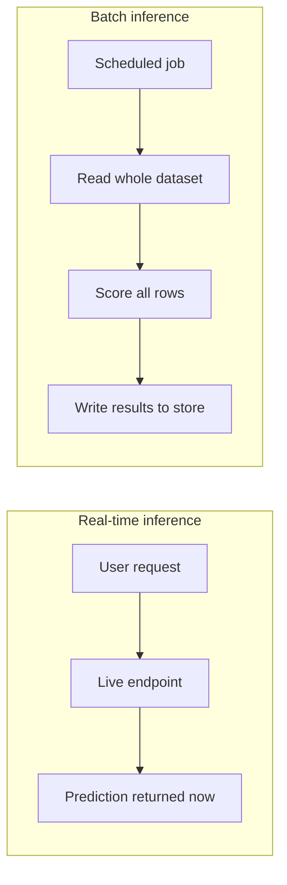
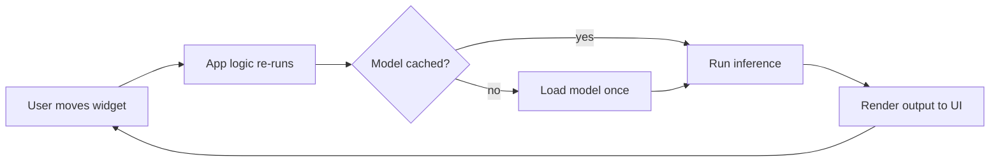
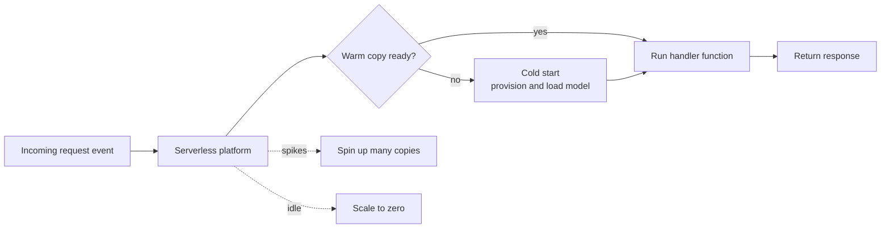

# Model Deployment: From a Trained Model to a Live Service

A machine learning model that lives only inside a notebook produces no value for anyone. **Deployment** is the act of taking a trained model out of the experimentation environment and making it available so that other software, or people, can actually send it data and receive predictions back. This guide builds the idea of deployment up from absolute scratch: what it means, the patterns used to do it, how lightweight demo interfaces are built, and how "serverless" platforms let you run models without managing any machines yourself.

The three notebooks in this folder map onto three big ideas:

- `01_deployment_concepts.ipynb` what deployment is, the patterns and serialization formats, and serving frameworks.
- `02_streamlit_gradio.ipynb` building interactive demo user interfaces in pure Python.
- `03_serverless_deployment.ipynb` running models on managed cloud platforms that scale automatically.

---

## 1. What "Deploying a Model" Actually Means

To deploy a model is to install it somewhere it can run continuously and respond to requests. To understand that sentence we need a few foundational terms.

- **Server**: a computer (or program running on a computer) whose job is to wait for incoming requests and send back responses. Your laptop browser is a *client*; the machine it talks to is a *server*. A "server" can be a physical box in a data center, a rented virtual machine in the cloud, or just a process listening on a network port.
- **Request and response**: a request is a message a client sends asking for something ("here are four flower measurements, what species is this?"). A response is the answer the server sends back ("setosa, 97% confidence").
- **Endpoint**: a specific address on a server that handles one kind of request. For example, `https://api.example.com/predict` is an endpoint. Sending data to it triggers a prediction.
- **API (Application Programming Interface)**: the agreed-upon contract for how clients talk to a server which endpoints exist, what data they expect, and what they return. A **REST API** is the most common style: clients send requests over HTTP (the same protocol web browsers use), usually carrying data formatted as **JSON** (a simple text format of keys and values).
- **Inference**: running a trained model on new data to get a prediction. (Training is teaching the model; inference is using it.)
- **Latency**: how long one request takes to get a response, usually measured in milliseconds (ms).
- **Throughput**: how many requests the system can handle per unit of time (for example, predictions per second).

So deployment is fundamentally about wrapping your model in a server that exposes an endpoint, so that inference can happen on demand. The deeper challenges are *which pattern* fits your use case, *how to package* the model so it loads correctly elsewhere, and *how to scale* when traffic rises.

### Why deployment is its own discipline

A model that works in a notebook can fail in production for reasons that have nothing to do with accuracy: the prediction takes too long, the library versions differ, the model file is too large to ship, traffic spikes overwhelm the machine, or a new model version needs to replace the old one without interrupting users. Deployment is the engineering practice of solving these problems.

---

## 2. Deployment Patterns (Modes)

There is no single "right" way to deploy. The right pattern depends on how quickly you need predictions and how many you need at once. The `01_deployment_concepts.ipynb` notebook opens with a comparison table of four modes; here is the conceptual version.

### 2.1 Real-time (online) inference

The model sits behind a live endpoint and answers each request as it arrives, one at a time, as fast as possible. A user submits data and waits a fraction of a second for the answer.

- **Latency**: very low, ideally under ~100 ms.
- **Typical uses**: fraud detection at the moment a card is swiped, product recommendations as a page loads, autocomplete suggestions.
- **Trade-off**: the model must always be running and ready, which costs money even when no one is using it.

### 2.2 Batch inference

Instead of responding to individual requests, the model processes a large pile of data all at once on a schedule for example, scoring every customer in the database every night.

- **Latency**: high (minutes to hours) and that is perfectly fine, because no one is waiting in real time.
- **Throughput**: very high; you optimize for processing millions of rows efficiently.
- **Typical uses**: nightly risk scoring, generating a daily report, precomputing recommendations to store in a database.
- **Trade-off**: predictions are stale by the time they are used (they reflect last night's data), so this only works when freshness is not critical.

### 2.3 Streaming inference

A middle ground: the model continuously consumes a never-ending **stream** of events (think of a conveyor belt of data) and produces predictions as events flow by. This is commonly built on top of a streaming/message system such as Kafka (covered in the companion `message_queues` guide).

- **Latency**: medium.
- **Typical uses**: real-time analytics pipelines, monitoring sensor data, processing clickstreams.

### 2.4 Edge inference

The model runs **on the device** itself a phone, a camera, a car, an IoT (Internet of Things) sensor rather than on a remote server. ("Edge" means the edge of the network, far from central data centers.)

- **Latency**: very low, because there is no network round trip.
- **Throughput**: low, because device hardware is limited.
- **Typical uses**: face unlock on a phone, offline translation, a smart camera detecting motion.
- **Trade-off**: the model must be small and efficient, and updating it means updating every device.

| Mode | Latency | Throughput | Representative use case |
|------|---------|------------|--------------------------|
| Real-time (online) | Low (<100 ms) | Moderate | Fraud detection, recommendations |
| Batch | High (minutes-hours) | Very high | Nightly scoring, report generation |
| Streaming | Medium | High | Kafka-driven event pipelines |
| Edge | Very low | Low | Mobile apps, IoT devices |

Batch versus real-time inference contrasted by how predictions are produced:

### 2.5 Deployment strategies: releasing safely

Separate from *how often* you serve predictions is *how you roll out a new version* of a model without breaking things. The notebook illustrates three industry-standard strategies.

- **Blue-green deployment**: you run two identical environments "blue" (the current version) and "green" (the new version). All live traffic goes to blue while green is tested. When green is verified, a **load balancer** (a component that distributes incoming requests across servers) instantly switches all traffic from blue to green. If something is wrong, you switch back just as fast. The benefit is instant, reversible cutover with no half-deployed state.
- **Canary release**: instead of an all-or-nothing switch, you send a small slice of traffic (say 5%) to the new version while 95% stays on the stable one. If the new version's metrics look healthy, you gradually raise its share. The name comes from "canary in a coal mine" a small early warning before risking everyone.
- **Shadow mode**: the new model receives a *copy* of real traffic and makes predictions, but those predictions are only logged, never sent back to users. The old model still serves every real response. This lets you compare the new model against the old one on genuine production data with zero risk to users.

---

## 3. Model Packaging and Serialization

Before a model can be served, it has to be **serialized** converted from a live object in memory into a file on disk that can be saved, copied to another machine, and later loaded back. (Serialization means turning an in-memory object into a stream of bytes; deserialization is the reverse.) **Model packaging** is the broader act of bundling that serialized model together with everything needed to run it.

The choice of serialization format matters because it determines *where* and *how fast* the model can run. The notebook walks through the main formats.

| Format | Native framework | Strengths | Limitations |
|--------|------------------|-----------|-------------|
| **pickle / joblib** | scikit-learn | Dead simple, one line to save/load | Python-only; loading untrusted files is a security risk |
| **ONNX** | Framework-agnostic | Portable across frameworks and languages, optimized | Not every operation is supported |
| **TorchScript** | PyTorch | Runs in C++ without Python, optimized | More complex API |
| **SavedModel** | TensorFlow | Full TensorFlow ecosystem support | TensorFlow only |
| **GGUF** | llama.cpp | Compact, quantized large language models | Specific to LLMs |

A few concepts these formats introduce:

- **pickle / joblib**: Python's built-in way to dump any object to a file. In `01_deployment_concepts.ipynb`, a scikit-learn pipeline (scaler + classifier) is saved in one line with `joblib.dump(..., compress=3)`, where compression shrinks the file. The catch is that a pickle file embeds Python objects, so loading a file from an untrusted source can execute malicious code never load pickles you did not create.
- **ONNX (Open Neural Network Exchange)**: a shared, open file format that many frameworks can export to and import from. The point is *portability*: you can train in PyTorch, export to ONNX, and then run the model with the lightweight **ONNX Runtime** in Python, C++, JavaScript, or on mobile, without dragging the original training framework along. The notebook exports a small PyTorch network to ONNX and runs it through ONNX Runtime to confirm identical predictions.
- **TorchScript**: a way to convert a PyTorch model into a self-contained, optimized form that can run *without the Python interpreter*, including inside C++ applications. There are two ways to create it: **tracing** (run the model once with sample input and record the operations) and **scripting** (statically analyze the code, which can handle branches and loops). The notebook demonstrates tracing.
- **Quantization** (implied by GGUF): shrinking a model by storing its numbers with less precision (for example 4-bit integers instead of 32-bit floats). This makes large models small enough to run on modest hardware, at a small cost in accuracy.

### The "load once" principle

A recurring packaging idea is that loading a model is expensive, so you do it **once** when the server starts and reuse the loaded model for every request never reload it per request. This idea reappears everywhere (serving frameworks, serverless functions, message-queue workers).

---

## 4. Serving Frameworks

Writing your own server for every model is repetitive, so the ecosystem provides **serving frameworks**: ready-made servers built specifically to host models, handle incoming requests, batch them for efficiency, and expose monitoring. The notebook introduces two production-grade ones at a conceptual level.

- **TorchServe**: PyTorch's official serving tool. You package a model into a `.mar` archive (a model archive bundling the serialized model plus a "handler" describing how to preprocess input and postprocess output), then start a server that exposes an HTTP endpoint you can `POST` data to.
- **Triton Inference Server** (from NVIDIA): a high-performance server that can host models from *many* frameworks (ONNX, PyTorch, TensorFlow, and more) side by side. You arrange models in a **model repository** (a folder structure) with a configuration file per model declaring the input and output shapes, then run the server (typically in a container) which serves them with features like automatic batching and GPU acceleration.

The key mental model: a serving framework turns "I have a model file" into "I have a running, monitored, optimized HTTP service" without you hand-writing the networking code.

---

## 5. Building Demo Interfaces: Streamlit and Gradio

An endpoint is great for software talking to software, but humans want a **user interface (UI)** buttons, sliders, charts to interact with a model. Traditionally, building a web UI requires HTML (page structure), CSS (styling), and JavaScript (interactivity). **Streamlit** and **Gradio** (the focus of `02_streamlit_gradio.ipynb`) let you skip all of that and build a working web app in pure Python.

### 5.1 Streamlit

Streamlit turns a plain Python script into an interactive web application. You write normal Python with a few special commands `st.slider(...)` creates a slider, `st.dataframe(...)` shows a table, `st.pyplot(...)` embeds a chart and Streamlit renders them as a web page. Whenever the user moves a slider or clicks a button, Streamlit simply **re-runs your whole script from top to bottom** with the new values.

The Streamlit and Gradio app flow, where user interaction drives the model and renders results:

That re-run-everything model is simple but would be wasteful if it retrained a model on every interaction. The notebook's example app shows the two tools that solve this:

- **Caching with `@st.cache_resource`**: marks something heavy (like a loaded or trained model) to be computed *once* and reused across re-runs, rather than rebuilt every time.
- **Caching with `@st.cache_data`**: similar, but for data that should be recomputed when its inputs change.
- **Session state (`st.session_state`)**: a place to remember values between re-runs (for example, keeping a trained model around so the "Prediction" tab can use what the "Training" tab produced).

The example app demonstrates the building blocks of a full dashboard: a **sidebar** for configuration controls, **columns** and **tabs** for layout, **metrics** for headline numbers, charts (heatmaps, bar charts), a **spinner** and **progress bar** for feedback during training, a **file uploader** for batch input, and a **download button** for results. Conceptually, this shows Streamlit's sweet spot: rich, multi-section data applications.

### 5.2 Gradio

Gradio is built around an even simpler idea: you have a Python *function* (it takes inputs, returns outputs), and Gradio automatically generates a matching UI for it. You declare what the inputs are (sliders, text boxes, image uploads) and what the outputs are (labels, plots, files), connect them to your function, and Gradio produces a shareable web interface.

The notebook's example uses Gradio's **Blocks** API the more flexible layout system to build a multi-tab demo: an iris classifier driven by sliders that returns class probabilities as a labeled bar, a sentiment-analysis text box, and a CSV batch-prediction tab. Gradio also offers **Examples** (clickable sample inputs) and a `share=True` option that creates a temporary public URL by tunneling through Gradio's servers handy for quickly showing a colleague a demo running on your laptop.

Gradio is especially tightly woven into the **Hugging Face** ecosystem (Hugging Face is a popular hub for sharing models and datasets), which makes it the default choice for quick model demos there.

### 5.3 Streamlit vs Gradio

| | Streamlit | Gradio |
|--|-----------|--------|
| Best for | Full dashboards and data apps | Quick model demos |
| Mental model | Re-run a script; render widgets | Wrap a function; auto-generate UI |
| UI control / layout flexibility | High | Medium |
| Hugging Face integration | Moderate | Native |
| Learning curve | Low | Very low |

### 5.4 Hosting the demos

A demo is only useful if others can reach it. The notebook covers two free hosting paths:

- **Hugging Face Spaces**: a free hosting service for Gradio and Streamlit apps. You create a Space, push your `app.py` and a `requirements.txt` (a file listing the Python packages your app needs), and the Space automatically builds and serves it.
- **Streamlit Community Cloud**: connect a GitHub repository, point it at your main file, and it deploys automatically, redeploying every time you push new code.

The shared idea: you provide the code plus a dependency list, and the platform handles the running.

---

## 6. Serverless Deployment

The deployment patterns so far still imply *you* run a server somewhere. **Serverless** (`03_serverless_deployment.ipynb`) removes that responsibility.

### 6.1 What "serverless" means

Despite the name, servers still exist but **you** never provision, configure, patch, or keep them running. You hand the cloud provider your code (or a container) and a description of when to run it, and the provider supplies the machines on demand, runs your code when a request arrives, and shuts everything down when idle. Crucially, you **pay per request and per second of execution**, not for an idle machine sitting around. This is the appeal: a model that gets ten requests a day costs almost nothing.

A core flavor of serverless is **FaaS Function as a Service**. You write a single function (a **handler**) that takes a request and returns a response; the platform runs that function for each incoming request and scales the number of concurrent copies up and down automatically. AWS Lambda, Google Cloud Functions, and Azure Functions are FaaS platforms.

The serverless request flow, where an event invokes a function that the platform scales on demand:

### 6.2 Auto-scaling

**Scaling** means adjusting how much computing capacity is running to match demand. Serverless platforms **auto-scale**: if 1,000 requests arrive at once, the platform spins up many copies of your function in parallel; when traffic drops, it tears them down, often all the way to **zero** (scale-to-zero), meaning you pay nothing during quiet periods. You never write scaling logic yourself.

### 6.3 The cold start problem

The trade-off for scale-to-zero is the **cold start**. When your function has not run recently, there is no copy ready, so the platform must first create a fresh environment, load your code, and load your model before it can answer adding a noticeable delay (anywhere from ~100 ms to several seconds, and worse for big ML models). A request that hits an already-running copy is a "warm" start and is fast.

The notebook lists standard mitigations:

- **Provisioned concurrency**: pay to keep a set number of copies permanently warm and ready.
- **Keep-alive pings**: periodically send a dummy request so the platform never lets the function go fully idle.
- **Smaller models and containers**: less to download and load means faster startup.
- **Lazy loading**: load the model the first time it is needed and then cache it (the "load once" principle again), so subsequent warm requests skip the load.

### 6.4 Serverless options for ML

| Platform | Type | ML support | Cold start |
|----------|------|-----------|------------|
| AWS Lambda | FaaS | Up to ~10 GB RAM | ~100 ms - 5 s |
| AWS SageMaker | Managed ML | Full ML lifecycle | Varies |
| GCP Cloud Run | Container | Any containerized model | ~1 s |
| Google Cloud Functions | FaaS | Lightweight models | <1 s |
| Azure Functions | FaaS | Moderate models | ~1 s |
| Modal | ML-native (with GPU) | Strong, GPU support | Fast |
| Fly.io | Container | Any | Fast |

### 6.5 How the notebook's examples illustrate the concepts

- **AWS Lambda handler**: the example defines a `lambda_handler(event, context)` function the entry point the platform calls per request. The model is loaded **outside** the handler into a global variable so it survives across invocations on a warm copy; a `get_model()` helper lazily fetches it (from S3, Amazon's object storage) only on the first, cold call. This single snippet embodies lazy loading, caching across invocations, and parsing a request to return a JSON response.
- **Lambda with a container image**: Lambda functions can also be shipped as a container (a packaged filesystem + code; see the Docker guide). The notebook's Dockerfile is based on AWS's Lambda base image and is the right approach when your model and dependencies are too large for a plain zipped function.
- **AWS SageMaker**: a *managed ML* service (the provider manages more of the ML lifecycle than raw FaaS). The notebook shows it supports several serving modes from one model: a **real-time endpoint** (always-on, low latency), an **asynchronous endpoint** (for large payloads where the caller does not block waiting), and **batch transform** (offline scoring of a whole dataset). This is a concrete instance of the batch-vs-real-time distinction from Section 2.
- **Modal**: an *ML-native* serverless platform where you describe your container image and resources (including GPUs) directly in Python decorators, and call a remote function with `.remote(...)`. Its `scaledown_window` setting (keep a copy warm for N seconds after the last call) is a built-in cold-start mitigation.
- **GCP Cloud Run**: a *container-based* serverless service you give it any container exposing an HTTP server, and it auto-scales it, including down to zero, with a configurable maximum number of instances to cap cost. This is the bridge between the Docker world and serverless.

The unifying theme: along a spectrum from "I manage everything" to "I just hand over a function," serverless sits at the far end, trading some control and the cold-start tax for zero machine management and pay-per-use pricing.

---

## 7. Putting It Together

Deployment is the discipline of making a trained model usable by the outside world. The choices form a layered decision:

1. **Pattern** Do you need answers instantly (real-time), in bulk on a schedule (batch), continuously from a stream (streaming), or on the device itself (edge)?
2. **Packaging** Serialize the model into a format that fits the target environment (joblib for quick Python, ONNX/TorchScript for portability and speed, GGUF for compact LLMs), and load it once.
3. **Serving** Wrap it in an endpoint, either by hand, with a serving framework (TorchServe, Triton), or via a quick UI (Streamlit, Gradio) for humans.
4. **Infrastructure** Decide who runs the machines: you (always-on servers), or a serverless platform that auto-scales and bills per request, accepting the cold-start trade-off.
5. **Rollout** Release new versions safely with blue-green, canary, or shadow strategies.

Each later guide in this series deepens one piece of this picture: message queues add asynchronous decoupling for variable ML load, Docker provides the reproducible packaging that nearly all of these patterns depend on, and Kubernetes orchestrates many such containers at scale.

---

## 4. Edge Deployment

Edge deployment runs ML models directly on end-user devices (phones, IoT sensors, embedded hardware) rather than sending data to a server. Benefits: zero network latency, privacy (data never leaves device), offline operation, elimination of server costs at scale.

The standard pipeline: train in PyTorch or scikit-learn, export to ONNX (Open Neural Network Exchange), run with ONNX Runtime on any target platform. ONNX Runtime supports CPU, GPU, and specialized accelerators (ARM, Qualcomm) through execution providers.

Quantization is the primary optimization for edge: INT8 quantization reduces model size by 4x and inference speed by 2-4x with typically less than 1% accuracy loss on most tasks. Use onnxruntime.quantization.quantize_dynamic() as the first optimization to try.

Platform-specific formats: TFLite (Android/embedded), CoreML (Apple devices/macOS). Both can be exported from ONNX. Benchmark on your actual target hardware, not on a development machine.
