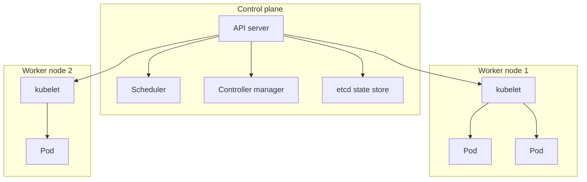
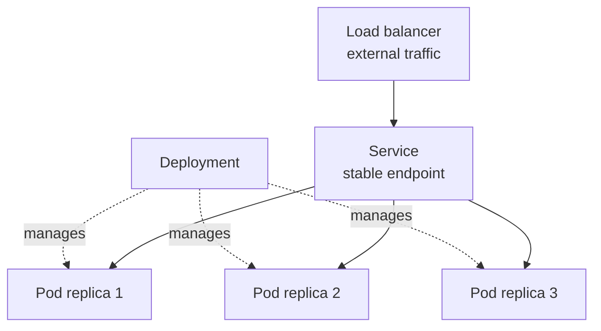
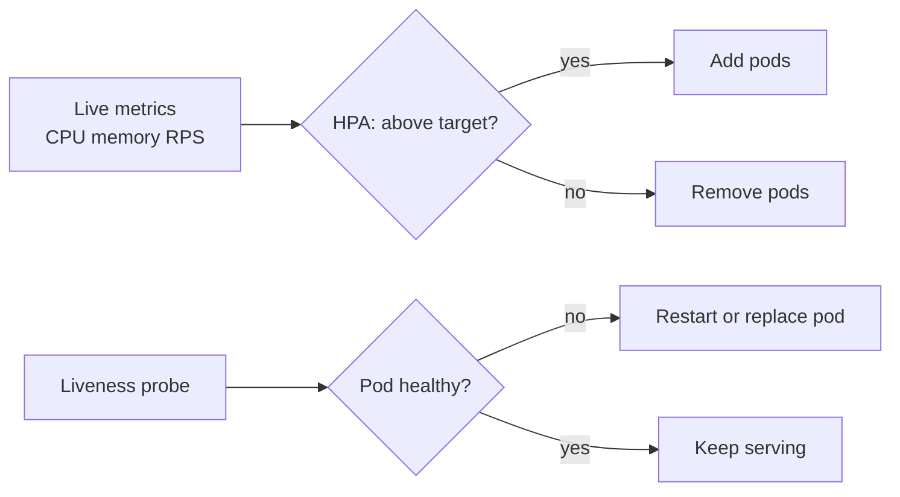

# Kubernetes: Orchestrating Containers for Machine Learning at Scale

Docker lets you package an application into a container and run it on a single machine. But real production systems run *many* containers across *many* machines, and they need those containers to be automatically placed, kept alive when they crash, scaled up under load, scaled down when idle, and updated without downtime. Doing all of that by hand is impossible at scale. **Kubernetes** is the system that does it for you. This guide explains Kubernetes from absolute scratch what orchestration means, the core building blocks, and why it has become the standard home for serving machine learning models. It follows the single notebook in this folder, `01_kubernetes.ipynb`.

---

## 1. What Orchestration Means

Once you have more than a handful of containers spread over several machines, a host of questions appears: Which machine should each container run on? What happens when a container crashes who restarts it? How do you run five copies of a service and split traffic among them? How do you replace version 1 with version 2 while users are connected? How do you add more copies automatically when traffic surges at noon and remove them at midnight?

**Container orchestration** is the automation of exactly these tasks: deploying containers, placing them on machines, keeping the desired number running, scaling them, networking them together, and updating them all managed by software rather than humans. **Kubernetes** (commonly abbreviated **K8s**) is the most widely used orchestration platform. The notebook's one-line definition captures it: Kubernetes automates the deployment, scaling, and management of containerized applications.

A foundational idea underlies all of Kubernetes: **declarative desired state**. You do not give Kubernetes step-by-step commands ("start a container here, then another there"). Instead you *declare* what you want "I want three copies of this service running" and Kubernetes continuously works to make reality match that declaration. If a copy dies, Kubernetes notices the mismatch and starts a replacement. This self-correcting loop is the heart of the system.

---

## 2. Cluster Architecture: Control Plane and Worker Nodes

A few structural terms come first.

- **Node**: a single machine (physical or virtual) in the system. Nodes are where your containers actually run.
- **Cluster**: the whole group of nodes managed together by Kubernetes, working as one pool of computing resources. You think of a cluster as a single big computer, and Kubernetes decides which physical node each workload lands on.

A cluster is split into two kinds of nodes, shown in the notebook's architecture diagram:

- **Control plane** (the "brain," historically called the master): the set of components that make global decisions and maintain the desired state. It includes the **API server** (the front door every command and component talks to it), the **scheduler** (decides which node a new container should run on, based on available resources), the **controller manager** (the watchdogs that compare desired vs actual state and fix differences), and **etcd** (a reliable database storing the entire cluster's state).
- **Worker nodes**: the machines that run your actual workloads. Each worker runs a **kubelet** an agent that talks to the control plane and ensures the containers it has been assigned are running and healthy.

The cluster architecture, with a control plane directing kubelets on worker nodes that run pods:

So the control plane decides *what* should run and *where*, and the kubelets on the workers make it actually happen.

---

## 3. The Core Resources

You tell Kubernetes what you want by creating **resources** (also called objects), usually written in YAML files called **manifests** and submitted with `kubectl apply` (`kubectl` is the command-line tool for talking to a cluster). The notebook's resource table lists the essentials; here is what each means.

### 3.1 Pod the smallest unit

A **Pod** is the smallest thing Kubernetes can deploy: a wrapper around one or more containers that always run together on the same node, sharing networking and storage. Most pods hold a single container (for example, one model-serving API). You rarely create pods directly, because a bare pod is fragile if it dies, nothing brings it back. Higher-level resources manage pods for you.

### 3.2 Deployment managing replicas and rollouts

A **Deployment** is the resource that manages a set of identical pods on your behalf. You declare how many copies (**replicas**) you want, and the Deployment guarantees that many are always running. If one crashes or a whole node fails, the Deployment automatically creates a replacement this is **self-healing**. A Deployment also handles **rolling updates**: when you change to a new image version, it replaces pods gradually (a few at a time) so the service never fully goes down, and it can **roll back** to the previous version if something breaks. A Deployment of replica pods sitting behind a Service and load balancer that routes external traffic:

The notebook's example Deployment requests three replicas with a `RollingUpdate` strategy configured for zero downtime (`maxUnavailable: 0`).

### 3.3 Service a stable network address

Pods are temporary; they come and go, and each gets a fresh internal IP address when created. So how does anything reliably reach them? A **Service** provides a single, stable network endpoint (a fixed name and address) that automatically routes traffic to whichever pods are currently alive behind it, **load-balancing** across them. Clients talk to the Service and never worry about individual pods appearing and disappearing. Services come in types `ClusterIP` (reachable only inside the cluster, the default), `LoadBalancer` (exposed to the outside world), and others. A related resource, the **Ingress**, routes external HTTP traffic from a public hostname (like `ml-api.company.com`) to the right Service inside the cluster.

### 3.4 ConfigMap and Secret configuration

A **ConfigMap** holds non-sensitive configuration (settings like a model path or log level) separately from the container image, so you can change configuration without rebuilding the image. A **Secret** does the same for *sensitive* data passwords, API keys, database URLs with extra handling so they are not stored in plain sight. Pods read these values as environment variables.

### 3.5 PersistentVolume durable storage

Because pods are ephemeral, anything written inside them is lost when they restart. A **PersistentVolume** is durable storage in the cluster that outlives any single pod, claimed by a pod via a **PersistentVolumeClaim**. In ML this is how a model file is stored once and mounted (often read-only) into the serving pods, exactly as the notebook's Deployment mounts a model from a persistent claim.

### 3.6 Namespace isolation

A **Namespace** is a virtual partition of the cluster used to keep groups of resources separate for example, a `ml-prod` namespace for production and another for development, or one per team. It is like having separate folders within the same cluster.

| Resource | What it provides |
|----------|------------------|
| Pod | Smallest deployable unit; wraps one or more containers |
| Deployment | Keeps N replicas of pods running; handles rollouts and self-healing |
| Service | Stable network endpoint and load balancing across pods |
| Ingress | Routes external HTTP traffic to Services |
| ConfigMap | Non-secret configuration data |
| Secret | Sensitive data (passwords, keys) |
| PersistentVolume | Durable storage that outlives pods |
| HPA | Horizontal Pod Autoscaler auto-scales replica count |
| Namespace | Virtual partition for isolation |

---

## 4. Health Checks: How Kubernetes Knows a Pod Is Healthy

Self-healing only works if Kubernetes can tell whether a pod is actually working. It does this with **probes** small checks it runs against each container. The notebook's Deployment defines two:

- **Readiness probe**: "Is this pod ready to receive traffic *yet*?" Until it passes, the Service withholds traffic from the pod. This prevents sending requests to a model server that is still loading a large model.
- **Liveness probe**: "Is this pod still alive and not stuck?" If it starts failing, Kubernetes restarts the container automatically.

Both typically work by hitting an HTTP endpoint like `/health` on the container at regular intervals. Probes are what turn "the process is running" into "the application is genuinely serving" a meaningful distinction for slow-to-start ML services.

---

## 5. Scaling: Manual and Automatic

**Scaling** means changing how many pods run to match demand.

- **Manual scaling**: you set the replica count yourself (e.g., scale a Deployment to five replicas).
- **Horizontal Pod Autoscaler (HPA)**: the resource that scales *automatically*. ("Horizontal" scaling means adding *more pods*, as opposed to "vertical" scaling, which means giving an existing pod more CPU/memory.) You give the HPA a target for instance, keep average CPU usage at 70% along with a minimum and maximum number of replicas. The HPA watches the live metrics and adds pods when load rises and removes them when load falls, all on its own. The notebook's HPA example scales between 2 and 20 replicas based on CPU, memory, and even a custom "requests per second" metric, and includes stabilization windows so it does not flap up and down too aggressively.

The autoscaling and self-healing loops, where Kubernetes continuously corrects reality toward the desired state:

This automatic, metric-driven scaling is one of the biggest reasons ML serving lives on Kubernetes: inference traffic is often spiky, and the HPA right-sizes capacity continuously.

---

## 6. Why Kubernetes for Machine Learning

The notebook opens by listing precisely why ML workloads benefit from orchestration. Each maps onto a concept above.

- **Scale inference**: auto-scale from a few replicas to many (even from zero) as request volume changes, via the HPA so you serve traffic spikes without paying for idle capacity the rest of the time.
- **GPU scheduling**: ML often needs GPUs. Kubernetes can treat a GPU as a requestable resource, so a pod declares it needs one GPU and the scheduler places it on a node that has one. The notebook's GPU Deployment requests `nvidia.com/gpu: 1` and uses a **nodeSelector** (to target GPU-equipped nodes) and **tolerations** (to allow scheduling onto specially reserved GPU nodes). This is how expensive GPU hardware is allocated precisely rather than wastefully.
- **Resource isolation**: separate namespaces, plus per-pod CPU/memory **requests** (the minimum guaranteed) and **limits** (the cap), keep teams and workloads from interfering with one another and from starving the cluster.
- **Rolling updates**: deploy a new model version with zero downtime via the Deployment's rolling strategy, and roll back instantly if metrics regress the safe-release idea applied to models.
- **Cost efficiency**: scale idle services down (potentially to zero) so you do not pay for capacity no one is using.

In short, the same properties that make Kubernetes good for any web service self-healing, stable networking, automatic scaling, controlled rollouts are exactly what unreliable, bursty, hardware-hungry ML serving needs.

---

## 7. ML-Native Platforms on Top of Kubernetes

Plain Kubernetes serves containers; the ML community has built higher-level tools *on top of* it to handle ML-specific workflows. The notebook introduces two.

- **Kubeflow**: a Kubernetes-native ML platform. Its **Pipelines** feature lets you define a multi-step ML workflow for example, preprocess data, train a model, then evaluate and register it only if accuracy beats a threshold as a graph of steps, where each step runs as its own container in the cluster. The notebook's example expresses each stage as a Python function that becomes a containerized pipeline component, with outputs of one step feeding the next. This turns "run these scripts in order on a powerful cluster" into a managed, repeatable pipeline.
- **KServe**: a Kubernetes tool focused specifically on **model serving**. Instead of writing all the Deployment, Service, scaling, and routing manifests yourself, you create a single `InferenceService` resource that points at a stored model (e.g., a scikit-learn model in cloud storage), and KServe generates the full serving stack behind the scenes including auto-scaling (even scale-to-zero), and optional **transformers** (pre/post-processing steps) and **explainers** (components that explain a prediction). It exposes a standard prediction endpoint you can send data to. KServe is essentially "model serving as a single declarative resource" on top of all the Kubernetes machinery described above.

---

## 8. Summary

Kubernetes is the system that runs containers across a fleet of machines as if they were one computer, driven by a simple but powerful idea: you declare the desired state, and Kubernetes continuously makes reality match it.

- A **cluster** of **nodes** is split into a **control plane** (which decides what runs where, via the API server, scheduler, controllers, and the etcd state store) and **worker nodes** (which run the workloads under a kubelet agent).
- **Pods** are the smallest unit; **Deployments** keep the right number of pods alive (self-healing) and roll out updates without downtime; **Services** and **Ingress** give pods a stable address and route traffic to them; **ConfigMaps**, **Secrets**, and **PersistentVolumes** supply configuration and durable storage; **Namespaces** isolate workloads.
- **Probes** let Kubernetes verify health, and the **Horizontal Pod Autoscaler** adds and removes pods automatically based on live metrics.
- For **ML**, all of this delivers auto-scaling inference, precise GPU scheduling, resource isolation, zero-downtime model updates, and cost savings and ML-native layers like **Kubeflow** (pipelines) and **KServe** (one-resource model serving) build on top of it to streamline the ML lifecycle.

Where Docker (the companion guide) packages a model into a portable container and Docker Compose runs a stack on one machine, Kubernetes is what carries that same stack to many machines, at production scale, with automation doing the operational heavy lifting.
