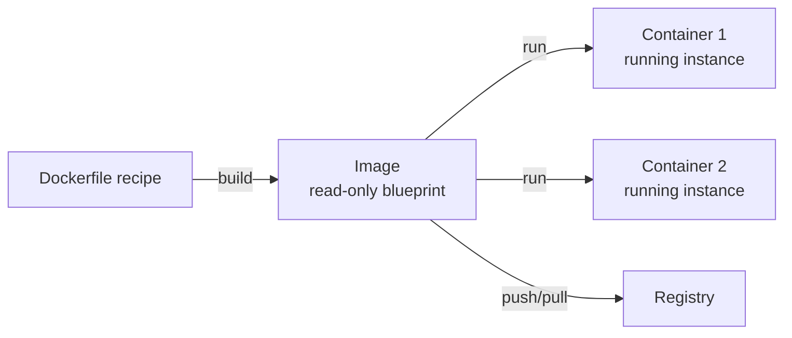
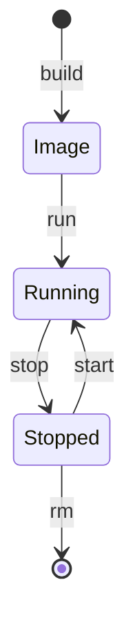
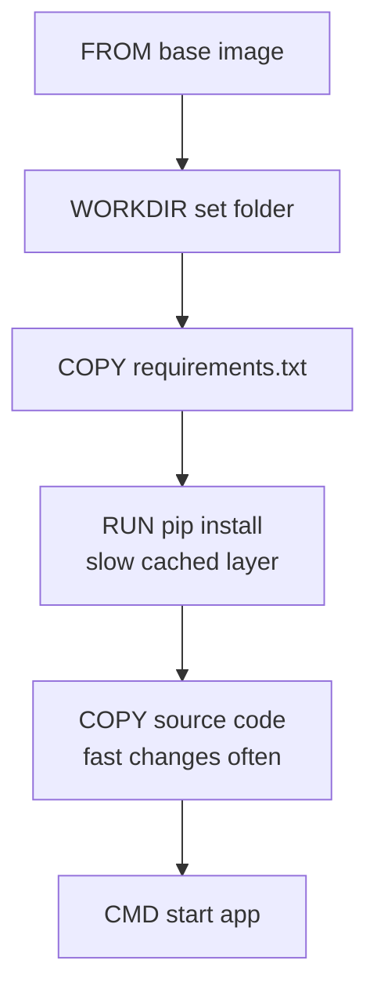
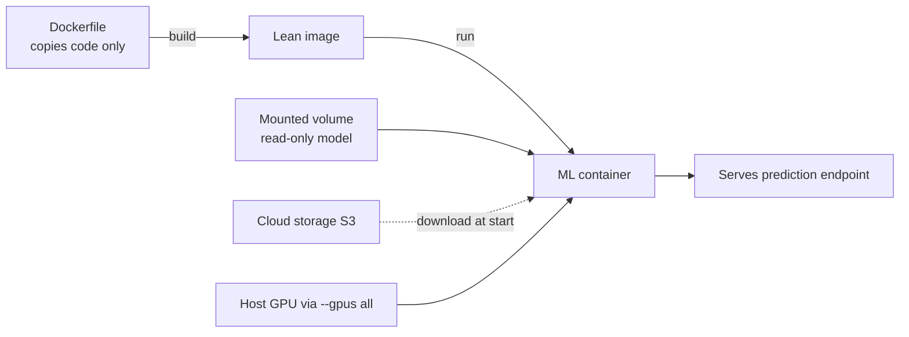

# Docker: Containers for Reproducible Software and Machine Learning

"It works on my machine" is the oldest complaint in software. A program that runs perfectly on your laptop can fail on a colleague's computer or on a server because the operating system, the installed libraries, or even tiny version differences are not the same. **Docker** exists to eliminate this entire class of problem by packaging an application together with everything it needs to run into a single, portable unit called a **container**. This guide builds the idea of containers from absolute scratch, then shows how Docker becomes indispensable for machine learning. It follows the two notebooks in this folder: `01_docker_basics.ipynb` (the fundamentals) and `02_docker_for_ml.ipynb` (applying them to ML systems).

---

## 1. The Problem: Environments Differ

Before Docker, two big ideas are worth naming.

- An **environment** is the complete surrounding a program needs in order to run: the operating system, system libraries, the language runtime (e.g., Python 3.11), the installed packages and their exact versions, environment variables, and configuration files. If any of these differ between two machines, the same code can behave differently or crash.
- **Reproducibility** is the property that software runs the same way everywhere on your laptop, on a teammate's machine, in testing, and in production. Achieving reproducibility by hand (carefully installing identical versions everywhere) is tedious and error-prone.

Docker delivers reproducibility by capturing the entire environment *once* and shipping it as a unit, so the program carries its environment with it.

---

## 2. Containers vs Virtual Machines

To understand a container, it helps to compare it with the older technology it improves upon: the **virtual machine (VM)**.

A **virtual machine** is a complete, simulated computer running inside your real computer. It includes its own full **guest operating system** (a second OS running on top of your host OS), managed by a layer called a **hypervisor**. Because each VM carries a whole OS, VMs are heavy gigabytes in size and tens of seconds (or minutes) to boot.

A **container** is lighter. Instead of simulating a whole computer, a container packages just the application and its dependencies, and **shares the host machine's operating system kernel** (the core of the OS) rather than booting its own. Containers are isolated from each other so they do not interfere, but they skip the expensive duplicate OS. The result: containers are typically megabytes in size and start in *seconds* or less.

The `01_docker_basics.ipynb` notebook opens with a diagram of exactly this contrast VMs stack each app on its own guest OS over a hypervisor, while containers stack apps directly on a shared container engine over one host OS.

| Aspect | Virtual Machine | Container |
|--------|-----------------|-----------|
| What it virtualizes | Entire computer (with its own OS) | Just the application + dependencies |
| Operating system | Full guest OS per VM | Shares the host's OS kernel |
| Size | Gigabytes | Megabytes |
| Startup time | Seconds to minutes | Milliseconds to seconds |
| Isolation | Very strong (separate OS) | Strong (process-level) |
| Overhead | High | Low |

The practical upshot: you can run many containers on one machine where you could only fit a few VMs, and you can start, stop, and replace them almost instantly.

---

## 3. Docker's Building Blocks

Docker is the most popular system for creating and running containers. A handful of terms form its vocabulary; the notebook lists them all.

- **Image**: a read-only template a frozen snapshot of a filesystem containing your application, its dependencies, and instructions for how to start it. An image is the blueprint.
- **Container**: a running instance of an image. The blueprint (image) is inert; the container is the live, executing copy. You can start many containers from one image, just as you can build many houses from one blueprint. **This image-versus-container distinction is the single most important concept in Docker**: the image is what you build and ship; the container is what actually runs.
- **Docker daemon (`dockerd`)**: a background service on the host that does the real work of building images and running containers.
- **Docker client (`docker`)**: the command-line tool you type commands into; it sends those commands to the daemon.
- **Registry**: a storage service for sharing images, much like an app store. Docker Hub is the public default; cloud providers offer private ones (AWS ECR, Google GCR). You **push** images up to a registry and **pull** them down.
- **Layer**: an image is built in stacked layers, one per build instruction. Layers are explained in detail below.

An image is the inert blueprint; containers are the running instances started from it:

The container lifecycle from building an image to running and stopping a container:

A typical lifecycle: you write a recipe (a Dockerfile), `build` it into an image, optionally `push` it to a registry, then `pull` and `run` it anywhere to get a container. The notebook's command reference groups the everyday commands by category managing images (`build`, `pull`, `push`, `rmi`), running and inspecting containers (`run`, `ps`, `stop`, `logs`, `exec`), and handling volumes and networks (covered below).

---

## 4. The Dockerfile and Image Layers

### 4.1 What a Dockerfile is

A **Dockerfile** is a plain text file containing the step-by-step recipe for building an image. Each line is an instruction. The notebook's reference Dockerfile walks through the common ones:

- **`FROM`** choose a **base image** to start from (for example, `python:3.11-slim`, a minimal image that already has Python installed). Every image is built on top of another; `FROM` picks the foundation. The notebook stresses *pinning* a specific version (not just `python`) so builds stay reproducible.
- **`WORKDIR`** set the working directory inside the image, like `cd` into a folder.
- **`COPY`** copy files from your project into the image (for instance, your source code or a `requirements.txt` dependency list).
- **`RUN`** execute a command during the build, typically to install packages (e.g., `pip install` or `apt-get install`). This is where the environment gets assembled.
- **`ENV`** set environment variables available when the container runs.
- **`ARG`** set build-time variables.
- **`EXPOSE`** document which network port the application listens on (e.g., 8000).
- **`USER`** switch to a non-root user; the notebook does this for security, since running as root inside a container is risky.
- **`HEALTHCHECK`** define a command Docker runs periodically to confirm the app inside is actually healthy.
- **`ENTRYPOINT` and `CMD`** specify what runs when the container starts. The distinction matters: `ENTRYPOINT` is the fixed command, while `CMD` provides default arguments that can be overridden from the command line.

### 4.2 Layers and the build cache

Here is the concept that makes Docker fast and worth understanding deeply. **Each instruction in a Dockerfile creates a layer** a saved difference on top of the previous one. The final image is the stack of all these layers. Crucially, Docker **caches** each layer: if you rebuild and a layer's inputs have not changed, Docker reuses the cached layer instead of redoing the work.

Each Dockerfile instruction stacks a cached layer; ordering deps before code keeps the slow layer cached:

This is why instruction *order* matters enormously. Installing dependencies is slow; copying your code is fast and changes often. If you copy all your code *before* installing dependencies, then any code change invalidates the cache and forces a full reinstall every build. If instead you copy only the dependency list, install dependencies, and *then* copy the code, the expensive dependency layer stays cached across code changes. The notebook makes this explicit with a "bad vs good" comparison: copy `requirements.txt` and `pip install` first, copy the rest of the code last. In `01_docker_basics.ipynb`, the Dockerfile cell shows this layered ordering directly, and `docker history` can be used to inspect the layers an image is made of.

### 4.3 Multi-stage builds

A **multi-stage build** uses more than one `FROM` in a single Dockerfile to keep the final image small. The idea: one stage (the "builder") installs compilers and build tools and produces compiled artifacts; a second, lean stage (the "runtime") copies only the finished artifacts and leaves all the bulky build tools behind. The notebook shows building Python "wheels" (pre-compiled packages) in a builder stage, then installing them into a slim runtime stage shrinking the image from roughly 500 MB to 150 MB. Smaller images pull faster, start faster, and have a smaller attack surface.

### 4.4 The `.dockerignore` file

Just as `.gitignore` keeps files out of version control, a **`.dockerignore`** file keeps files out of the image build caches, `.git`, virtual environments, logs, and especially large data folders. This keeps images lean and builds fast, and prevents accidentally baking secrets or huge datasets into an image.

---

## 5. Volumes: Persisting and Sharing Data

Containers are **ephemeral** when a container is deleted, everything written inside it vanishes. That is intentional (containers should be disposable), but it raises a question: how do you keep data, like a database's files or a model file, alive beyond the container's life? The answer is a **volume**.

A **volume** is storage that lives *outside* the container's own filesystem but is mounted *into* it, so data survives the container being stopped or removed. The notebook distinguishes two kinds:

- **Named volume**: storage Docker manages for you, referenced by a name (e.g., `my-data`). Ideal for databases and other long-lived state.
- **Bind mount**: maps a specific folder on the host machine directly into the container (e.g., mounting your current project directory). Ideal during development so code changes on the host appear instantly inside the container, and for supplying files like models from the host.

Volumes can also be mounted **read-only**, which the ML examples use for model files the container should read but never modify.

---

## 6. Networking: Letting Containers Talk

By default a container is isolated, but real applications have multiple containers (an API, a database, a cache) that must communicate. Docker **networking** connects them. The notebook covers the main modes:

- **Bridge network** (the default): containers attached to the same user-defined bridge network can reach each other *by container name* as if it were a hostname. The notebook's example puts a database and an API on one network so the API connects using `postgres` as the host. This name-based discovery is the everyday way multi-container apps wire together.
- **Host network**: the container shares the host's network directly, skipping the isolation layer (and the need for port mapping).
- **None**: the container gets no network access at all maximum isolation for security-sensitive tasks.

A related everyday concept is **port mapping** (`-p 8080:8000`): the application inside the container listens on a port (8000), and you map it to a port on the host (8080) so the outside world can reach it. Without mapping, a containerized server is unreachable from outside.

---

## 7. Docker for Machine Learning

Everything above applies to any software, but `02_docker_for_ml.ipynb` highlights the particular challenges ML brings, and how Docker addresses each.

### 7.1 Why ML needs Docker

- **Reproducible environments**: ML stacks are notoriously fragile specific versions of NumPy, PyTorch, CUDA, and dozens of other libraries must line up exactly. Docker freezes the whole stack into an image, so the model that worked in training runs identically in production. This is Docker's headline benefit for ML.
- **Dependency isolation**: different models or services can require conflicting library versions; containers keep each in its own isolated environment.
- **Multi-service systems**: a real ML application is rarely just a model it is an API, a database, a cache, a model server, a metrics system. Docker lets you run all of them together consistently.

### 7.2 ML-specific challenges and their fixes

The notebook calls out concerns that are unusual outside ML:

- **Large model files (gigabytes)**: a strong recommendation is to **never bake big models into the image**. Doing so bloats every pull and every layer. Instead, load the model at runtime from a mounted **volume**, or download it from cloud storage (like S3) when the container starts. The ML Dockerfile in the notebook copies only the application code and reads the model from a mounted path a direct application of the volume concept.
- **Base image selection**: the notebook compares base images by size and purpose. A plain `python:3.11` is ~1 GB; `python:3.11-slim` is ~150 MB and good for production APIs; CUDA and PyTorch GPU images are several gigabytes because they bundle the GPU stack. Choosing the right base balances size against capability.

| Base image | Approx. size | Use case |
|------------|--------------|----------|
| `python:3.11` | ~1 GB | General-purpose Python |
| `python:3.11-slim` | ~150 MB | Production APIs |
| `python:3.11-alpine` | ~50 MB | Minimal (can hit compilation issues) |
| `nvidia/cuda:...-runtime` | ~4 GB | GPU inference |
| `nvidia/cuda:...-devel` | ~8 GB | GPU training |
| `pytorch/pytorch:...-cuda...` | ~8 GB | PyTorch + CUDA |

### 7.3 GPU support

Many ML models run far faster on a **GPU** (Graphics Processing Unit hardware originally for graphics, now the workhorse of deep learning). Letting a container use the host's GPU requires extra plumbing: an NVIDIA base image (containing the **CUDA** toolkit, NVIDIA's GPU computing platform), the **NVIDIA Container Toolkit** installed on the host (a bridge that exposes the host's GPU to containers), and the `--gpus all` flag when running the container. The notebook shows installing the toolkit, configuring Docker to use it, and verifying with `nvidia-smi` (a tool that reports GPU status) run *inside* a container. Conceptually: a GPU is a host resource, and you must explicitly grant a container access to it.

### 7.4 Orchestrating a full stack with Docker Compose

Running one container is easy; coordinating six is not. **Docker Compose** is a tool for defining and running multi-container applications from a single YAML file (`docker-compose.yml`). You describe each **service** (a container and its configuration) once, and one command (`docker-compose up`) starts the whole system with shared networks and volumes wired up.

Docker for ML keeps large models out of the image and loads them from a mounted volume or cloud storage at runtime:

The notebook's Compose file models a complete ML stack: an API service, a Celery worker, a PostgreSQL database, a Redis cache/queue, an MLflow tracking server, and Prometheus + Grafana for metrics and dashboards. It ties together every concept above images built from Dockerfiles, environment variables, read-only volume mounts for models, a shared bridge network so services find each other by name, health checks, dependency ordering (`depends_on`), and resource limits. Compose also makes scaling a single service trivial (for example, running four worker replicas). This is the natural endpoint of Docker on a single machine; scaling such a stack across many machines is the job of Kubernetes, covered in the companion guide.

---

## 8. Summary

Docker solves the reproducibility problem by packaging an application with its entire environment into a portable unit:

- A **container** is a lightweight, isolated package that shares the host OS kernel far smaller and faster than a virtual machine.
- An **image** is the read-only blueprint; a **container** is the running instance. You build images from a **Dockerfile**, a recipe whose instructions become cached **layers** and ordering those instructions well (dependencies before code) makes builds fast.
- **Volumes** persist and share data beyond a container's life; **networking** lets containers find and talk to each other; **port mapping** exposes them to the outside world.
- For **ML**, Docker delivers the reproducible, conflict-free environments that fragile ML stacks demand, while best practices keep huge models *out* of images (loading them from volumes or cloud storage), and GPU access is granted explicitly via the NVIDIA Container Toolkit.
- **Docker Compose** orchestrates a whole multi-service ML stack on one machine, setting the stage for true cluster-scale orchestration with Kubernetes.

---

## 3. Helm and GitOps

Helm is the package manager for Kubernetes. Rather than maintaining large sets of raw YAML manifests, you define a Helm chart with templates and a values.yaml file of configurable parameters. Teams install, upgrade, and rollback deployments with single commands: helm upgrade my-model ./chart --set image.tag=v2.0.

GitOps is a deployment approach where Git is the single source of truth for the desired state of infrastructure. A GitOps operator (ArgoCD or Flux) watches a Git repository and continuously reconciles the cluster to match. Any change goes through Git (with review and audit trail), and the cluster automatically converges to the declared state.

For ML systems, GitOps enables safe environment promotion: dev -> staging -> prod as separate directories or branches in the same repo, each with its own values.yaml. Merging a PR that updates an image tag triggers an automatic deployment with full rollback capability.
