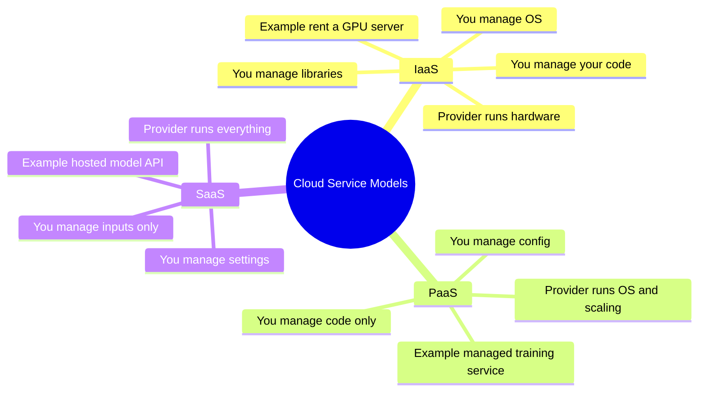
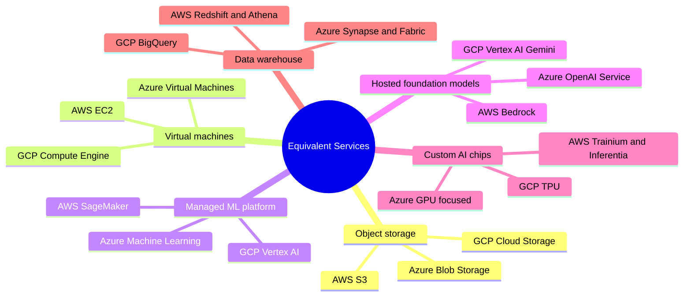
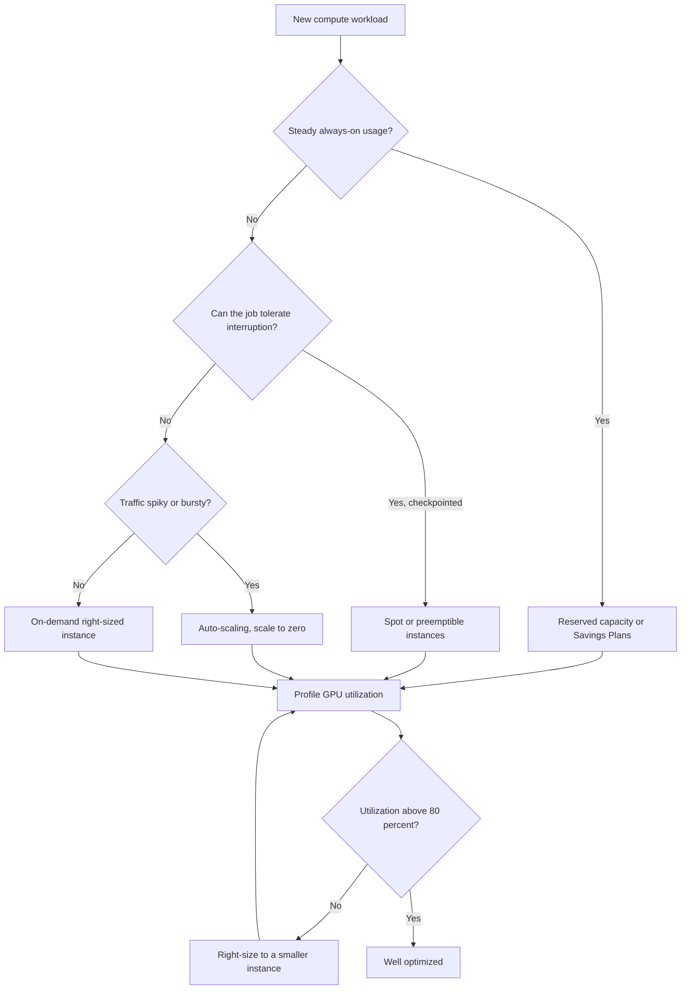
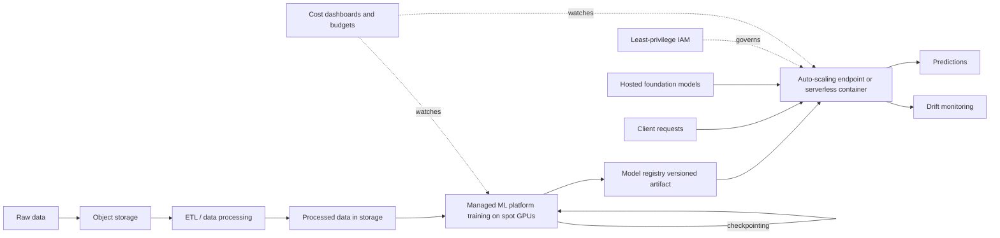

# Cloud Computing for AI

Modern AI systems rarely run on a single laptop. Training a large model can require dozens of specialized chips running for days; serving that model to thousands of users requires machines that scale up and down with demand; and the data involved can stretch into terabytes. The **cloud** is what makes all of this possible without owning a warehouse full of computers. This guide builds up the idea of cloud computing from absolute scratch, then tours the three dominant providers and their AI/ML offerings, and finally explains how to keep the bill under control.

---

## 1. What Cloud Computing Is

**Cloud computing** means renting computing resources processors, memory, disks, networking from a large provider over the internet, instead of buying and maintaining the physical hardware yourself. You pay only for what you use, and you can request more (or less) within minutes.

The traditional alternative is **on-premises** infrastructure: you buy servers, install them in a room, cool them, power them, secure them, and replace them when they age. The cloud replaces all of that with an API call. The provider owns enormous **data centers** buildings packed with servers and slices that capacity up among millions of customers.

### The core resource types

Every cloud workload, AI or otherwise, is built from three primitives:

- **Compute** the processors that run your code. This includes ordinary CPUs (general-purpose processors) and, crucially for AI, accelerators like **GPUs** (Graphics Processing Units, originally for graphics but excellent at the parallel math of neural networks) and custom AI chips.
- **Storage** where your data lives. This ranges from simple file storage to massive "object storage" that holds datasets and model files.
- **Networking** the connections that move data between machines, regions, and the outside world. Networking is also where security boundaries (firewalls, private networks) are drawn.

### Regions and availability zones

A provider's capacity is spread across **regions** (geographic areas like "US East" or "Europe West") and, within each region, **availability zones** (physically separate data centers). Putting copies of a service in multiple zones protects you when one data center has a power or network failure. Choosing a region close to your users reduces **latency** (the delay before a response arrives).

---

## 2. The Three Service Models: IaaS, PaaS, SaaS

Cloud services are usually classified by **how much the provider manages for you**. A useful analogy is getting a meal: you can buy raw ingredients and cook (most control, most work), order a meal kit with prepped ingredients (some help), or go to a restaurant (least work, least control).

| Model | What you get | What the provider manages | What you manage | AI example |
|-------|-------------|---------------------------|-----------------|------------|
| **IaaS** (Infrastructure as a Service) | Bare virtual machines, storage, networks | Physical hardware, virtualization | OS, libraries, your code | Renting a GPU server to train a model yourself |
| **PaaS** (Platform as a Service) | A managed environment to run code/training | Hardware *and* OS, scaling, runtime | Your code and configuration | A managed training service where you supply only a training script |
| **SaaS** (Software as a Service) | A finished application or API | Everything underneath | Just your inputs and settings | Calling a hosted model API and getting predictions back |

The three service models as layers of increasing managed responsibility:

- A **virtual machine (VM)** is a software-simulated computer running on shared physical hardware. It behaves like a real machine with its own operating system, but the provider can create and destroy it in seconds.
- A **managed service** is one where the provider handles the operational burden (patching, scaling, failover) so you focus on your application. Higher up the IaaS→PaaS→SaaS ladder means more is managed for you, at the cost of less low-level control.

For AI work, you constantly mix all three: you might store data in a storage service (PaaS-like), train on managed compute (PaaS), and call a hosted foundation model (SaaS).

---

## 3. Building Blocks Common to All Providers

Before looking at any single provider, it helps to know the categories that every cloud offers. Each provider gives these different brand names, but the concepts are identical.

- **Object storage** stores files (called *objects*) as opaque blobs identified by a key, organized into containers called *buckets*. It is cheap, virtually unlimited, and the standard home for training datasets, model artifacts (the saved files that *are* a trained model), and prediction outputs. It is not a file system with folders; the folder-like paths are just naming conventions.
- **Compute instances** rentable VMs, offered in **families** tuned for different jobs (general-purpose, memory-heavy, GPU-accelerated, etc.).
- **Serverless compute** run code without managing any server at all. You upload a function or container; the provider runs it on demand and bills per invocation. It can **scale to zero** (costs nothing when idle) but has a **cold start** cost: the first request after idling waits for the environment to spin up.
- **Containers and orchestration** a **container** packages your code with all its dependencies so it runs identically anywhere. **Kubernetes** is the dominant system for running many containers across many machines ("orchestration"); each provider offers a managed Kubernetes service.
- **Managed ML platform** an end-to-end service covering the full ML lifecycle: data prep, training, hyperparameter tuning, deployment, and monitoring.
- **Foundation model access** hosted access to large pre-trained models (language, image, embeddings) you call via an API rather than training yourself.
- **Data warehouse / analytics** services for running large analytical queries (often in SQL) over huge datasets.

---

## 4. AWS Amazon Web Services

AWS is the oldest and largest cloud provider and offers the broadest catalog of AI/ML services. The `01_aws_for_ai.ipynb` notebook walks through its core building blocks; here is the conceptual map.

### Core infrastructure

- **S3 (Simple Storage Service)** AWS's object storage and the backbone of nearly every ML pipeline on AWS. It supports **versioning** (keeping old copies of an object so results are reproducible) and **lifecycle policies** (rules that automatically move or delete old data to save money). The notebook's S3 cell shows the basic upload/download/list operations that move datasets in and out.
- **EC2 (Elastic Compute Cloud)** the IaaS VM service. Instances come in **families**; the ones that matter for AI carry GPUs. The notebook's instance table maps families to hardware and use case:

  | Family | Hardware | Typical use |
  |--------|----------|-------------|
  | p3 | NVIDIA V100 | Deep-learning training |
  | p4d | NVIDIA A100 | Large-model training |
  | g4dn | NVIDIA T4 | Inference, smaller training |
  | g5 | NVIDIA A10G | Inference and training |
  | inf2 | AWS Inferentia2 | Cost-optimized inference |
  | trn1 | AWS Trainium | Training (custom AWS chip) |

  Note the last two: **Inferentia** and **Trainium** are AWS's own custom AI chips, offered as cheaper alternatives to NVIDIA GPUs for inference and training respectively.
- **Lambda** serverless functions, ideal for lightweight, event-driven inference. It bills per invocation and scales automatically, but you must design around its limits (memory and a 15-minute timeout) and mitigate cold starts (e.g., with *provisioned concurrency*, keeping some instances warm).
- **ECS / EKS** managed containers. **ECS** runs Docker containers; **EKS** is managed Kubernetes, often paired with ML pipeline tools.

### SageMaker AWS's managed ML platform

**SageMaker** is the PaaS that covers the whole ML lifecycle (data prep → training → tuning → deployment → monitoring). Its pieces, as laid out in the notebook:

- **Studio** a web-based development environment (an IDE) with managed notebooks, experiment tracking, and a model registry.
- **Training Jobs** run training on any instance type without you managing the machine; supports built-in algorithms, custom containers, and **distributed training** (splitting one training run across many machines via *data parallelism* or *model parallelism*).
- **Hyperparameter Tuning (HPO)** automatically searches for the best **hyperparameters** (the dials you set before training, like learning rate) using strategies such as Bayesian optimization.
- **Endpoints** deploy a model behind a REST API for **real-time inference** (live predictions), with auto-scaling, multi-model endpoints (several models sharing one machine to cut cost), and a serverless option.
- **Batch Transform** offline prediction over a whole dataset at once, rather than one request at a time.
- **Pipelines** automate the multi-step ML workflow (this is **MLOps**: applying software-engineering discipline to ML).
- **Feature Store** a central place for **features** (the input variables a model uses), with a low-latency *online* store and a bulk *offline* store.
- **Model Monitor** detects **drift**, the gradual change in incoming data or model behavior that degrades accuracy over time.
- **Clarify** bias detection and **explainability** (understanding *why* a model made a prediction, e.g., via SHAP values).

### Bedrock foundation models as a service

**Bedrock** is the SaaS layer for hosted **foundation models** (large pre-trained models you call rather than train). It offers models from Anthropic (Claude), Meta (Llama), Amazon (Titan), Mistral, and Stability AI, plus features like **knowledge bases** for RAG (Retrieval-Augmented Generation, where the model is given relevant documents to ground its answers), agents, and **guardrails** (safety filters).

### Supporting services

- **IAM (Identity and Access Management)** the permission system. The guiding principle is **least privilege**: grant each component only the access it needs. Using **instance profiles** (roles attached to machines) avoids hardcoding credentials.
- **Data lake stack** `S3 (raw) → Glue (ETL) → S3 (processed) → Athena / SageMaker`. **Glue** is serverless ETL (Extract, Transform, Load cleaning and reshaping data). **Athena** queries S3 data directly with SQL, billed per query. **Lake Formation** adds governance.

---

## 5. GCP Google Cloud Platform

GCP is Google's cloud, notable for tight integration between large-scale data analytics and ML, and for the custom **TPU** hardware that powers Google's own research. The `02_gcp_for_ai.ipynb` notebook covers it.

### Vertex AI the unified ML platform

**Vertex AI** is GCP's equivalent of SageMaker, bundling the ML lifecycle into one product:

| Component | Role |
|-----------|------|
| Workbench | Managed JupyterLab notebooks |
| Training | Custom training jobs in any framework |
| Pipelines | ML pipelines (built on Kubeflow) |
| Model Registry | Version and manage models |
| Feature Store | Online + offline feature serving |
| Prediction | Online and batch deployment |
| Experiments | Track hyperparameters and metrics |
| Model Monitoring | Detect drift in production |

### BigQuery serverless data warehouse

**BigQuery** is a serverless **data warehouse** (a system for analytical queries over huge tables) that runs SQL at petabyte scale and bills per amount of data scanned. Its standout feature for ML is **BigQuery ML**, which lets you train models *directly in SQL* a `CREATE MODEL` statement trains, `ML.EVALUATE` measures, and `ML.PREDICT` scores. It supports regression, classification, clustering, boosted trees, deep networks, and even hosted LLMs, so analysts can build models without moving data out of the warehouse.

### Compute and serving

- **Cloud Run** serverless containers that scale to zero; well suited to model serving and now supporting GPUs.
- **Cloud Functions** event-driven serverless functions (GCP's analog to AWS Lambda).
- **TPUs (Tensor Processing Units)** Google's custom AI accelerators, purpose-built for the matrix multiplication at the heart of neural networks. Available on demand or as large **pods** (thousands of chips wired together for the biggest training runs), and usable from JAX, TensorFlow, and PyTorch/XLA.

### Models and data movement

- **Gemini via Vertex AI** access to Google's Gemini foundation models (natively *multimodal*, meaning they handle text, images, video, and audio) with enterprise guarantees.
- **GCS (Google Cloud Storage)** GCP's object storage, the equivalent of S3.
- **Dataflow** managed batch and streaming data processing built on Apache Beam, auto-scaling its workers; used for feature engineering at scale.
- **Pub/Sub** a managed message queue for ingesting real-time event streams that feed streaming inference pipelines.

---

## 6. Azure Microsoft Azure

Azure is Microsoft's cloud, known for deep enterprise integration and an exclusive partnership giving hosted access to OpenAI's models. The `03_azure_for_ai.ipynb` notebook covers it.

### Azure Machine Learning

**Azure ML** is the end-to-end platform. Its vocabulary differs but the concepts match the others:

| Concept | Meaning |
|---------|---------|
| Workspace | Central hub for all ML assets |
| Compute Cluster | Managed VMs for training |
| Compute Instance | Single-node development environment |
| Datastore | Connection to storage (Blob, ADLS) |
| Dataset | Versioned data reference |
| Environment | Docker image plus dependencies |
| Job | A training run (command, sweep, or pipeline) |
| Model Registry | Version and tag models |
| Endpoint | Managed online or batch inference |

A **sweep** is Azure's term for hyperparameter search.

### Azure OpenAI Service

This is Azure's distinguishing feature: **OpenAI's models** (GPT-4o, GPT-4, DALL-E for images, Whisper for speech, embedding models, and the o-series reasoning models) hosted inside Azure. The advantage over calling OpenAI directly is enterprise control: data stays within your Azure tenant, with SLAs, compliance certifications (HIPAA, SOC2, GDPR), private networking, and customizable content filtering.

### Pre-built AI APIs and platforms

- **Azure AI Services (Cognitive Services)** ready-made AI APIs requiring no training: Vision (object detection, OCR), Speech (speech-to-text and back), Language (sentiment, entity recognition, summarization), Translator, Document Intelligence (parsing forms and invoices), and AI Search (vector and hybrid search). This is the SaaS end of the spectrum.
- **Azure Databricks** a managed Apache Spark platform for combined data engineering and ML, with MLflow and Delta Lake built in.
- **Azure Blob Storage** Azure's object storage, with **hot / cool / archive** tiers (progressively cheaper storage for progressively less-accessed data). **ADLS Gen2** adds a folder-like hierarchical namespace for big-data workloads.
- **Azure AI Foundry** a hub for building AI apps: a model catalog, the visual **Prompt Flow** LLM pipeline builder, built-in evaluation, RAG, and an agent service.
- **ONNX Runtime** Microsoft's high-performance inference engine. **ONNX** is an open format for representing trained models from any framework; running them through ONNX Runtime can cut inference latency substantially.

---

## 7. Provider Comparison at a Glance

The same concepts wear different names across providers. This table is the key to translating between them.

| Capability | AWS | GCP | Azure |
|-----------|-----|-----|-------|
| Object storage | S3 | Cloud Storage (GCS) | Blob Storage |
| Virtual machines | EC2 | Compute Engine | Virtual Machines |
| Serverless functions | Lambda | Cloud Functions | Azure Functions |
| Serverless containers | (Fargate) | Cloud Run | Container Apps |
| Managed Kubernetes | EKS | GKE | AKS |
| Managed ML platform | SageMaker | Vertex AI | Azure Machine Learning |
| Hosted foundation models | Bedrock | Vertex AI (Gemini) | Azure OpenAI Service |
| Custom AI chips | Trainium / Inferentia | TPU | (GPU-focused) |
| Data warehouse | Redshift / Athena | BigQuery | Synapse / Fabric |
| Pre-built AI APIs | Rekognition, Comprehend, etc. | Vision/Speech/Language APIs | AI (Cognitive) Services |

No provider is universally "best." AWS has the broadest catalog, GCP excels at analytics-plus-ML and custom silicon, and Azure leads on enterprise integration and OpenAI access. Skills transfer between them because the underlying concepts are shared.

The same capabilities under each provider's brand names:

---

## 8. Cloud Cost Optimization

The cloud's pay-as-you-go flexibility cuts both ways: a single large training run can cost thousands of dollars, and an idle GPU endpoint quietly burns money around the clock. The `04_cloud_cost_optimization.ipynb` notebook is devoted to controlling this systematically.

### Where the money goes

The main cost drivers for ML are compute (priced as dollars-per-hour times hours used), storage (dollars per GB per month), **data transfer** (especially *egress* moving data *out* of a region or the cloud), API calls to hosted models (priced per token), and the overhead premium of managed services.

### Compute optimization

This is usually the biggest lever. A decision flow for choosing the cheapest compute that fits the workload:

- **Spot / preemptible instances** providers sell spare capacity at deep discounts (often 70-90% off), but can reclaim it on short notice (a two-minute warning). AWS calls these **Spot**, GCP **Spot/Preemptible**, Azure **Spot**. They are ideal for fault-tolerant training *if* you **checkpoint** regularly periodically saving training progress so an interrupted run can resume rather than restart. The notebook's spot-savings calculator models the tradeoff: even accounting for occasional interruptions and restarts, a 100-hour training job dropped from \$306 to ~\$96 (about 69% savings) in its example.
- **Reserved capacity / Savings Plans** commit to a steady level of usage for one to three years in exchange for a large discount (30-72%). Best for predictable, always-on workloads like a production inference endpoint.
- **Right-sizing** pick the smallest instance that still meets your latency target, and profile **GPU utilization** (aim for high, e.g., >80% a half-idle GPU is wasted money). Provider tools (AWS Compute Optimizer, GCP Recommender) suggest right-sizing automatically.
- **Auto-scaling** automatically add machines under load and remove them when idle, ideally **scaling to zero** when there is no traffic. *Target tracking* keeps utilization near a set point; *predictive scaling* anticipates known traffic patterns.

### LLM API cost optimization

When you call hosted models instead of running your own, cost is driven by **tokens** (the chunks of text models read and write, billed separately for input and output). The notebook's pricing comparison makes the spread vivid: at one million queries per day, the same workload can cost anywhere from a few thousand dollars a month on a small/cheap model to over a hundred thousand on a large one. Strategies:

1. **Prompt caching** reuse repeated context (like a long system prompt) at a steep discount instead of paying to re-process it every call.
2. **Batching** submit many requests together via a batch API, often at roughly half price, when you don't need instant responses.
3. **Model routing** send easy queries to a cheap model and reserve the expensive model for hard ones.
4. **Output-length control** cap the maximum output tokens, since output is usually the pricier half.
5. **Response caching** store answers to identical queries (e.g., in Redis) and skip the model entirely on a repeat. The notebook's `LLMCache` demo illustrates this with a simple time-to-live cache that achieved a 50% hit rate on repeated prompts.

### Model-level optimization

Making the model itself cheaper to run:

- **Quantization** store and compute the model's numbers at lower precision. Going from 32-bit to 16-bit roughly halves memory at about the same quality; 8-bit quarters it with small quality loss; 4-bit shrinks it further with moderate loss. Post-training methods like GPTQ and AWQ apply this to LLMs.
- **High-throughput serving (e.g., vLLM)** techniques like *PagedAttention* (efficient memory management) and *continuous batching* dramatically raise the number of tokens served per dollar.
- **Speculative decoding** a small "draft" model proposes several tokens cheaply and the large model verifies them in parallel, yielding a 2-3× speedup at the same quality.

### Storage optimization

- **Intelligent tiering** automatically move infrequently accessed data to cheaper storage tiers (recall Azure's hot/cool/archive tiers; AWS offers S3 Intelligent-Tiering).
- **Lifecycle policies** automatically delete stale artifacts (old experiment outputs) after a set period.
- **Compression and efficient formats** store data as gzip or columnar formats like Parquet for large size reductions.
- **Deduplication** don't store the same base model many times.

### Monitoring and FinOps

You cannot optimize what you cannot see. Each provider offers cost dashboards, budgets, and alerts: AWS Cost Explorer and Budgets, GCP Cost Management, Azure Cost Management + Billing. **FinOps** ("Financial Operations") is the practice of bringing financial accountability to cloud spending. Its principles, applied to ML teams:

1. **Visibility** tag every resource with its project, team, and experiment so costs can be attributed.
2. **Accountability** give each team a cost dashboard for its own spending.
3. **Optimization** review costs regularly and act on the biggest items.
4. **Culture** make engineers aware of what their experiments cost, so cost becomes a normal design consideration rather than an afterthought.

---

## 9. Putting It Together

End-to-end cloud AI architecture tying storage, compute, model serving, and governance together:

A realistic cloud-based ML system threads all of these concepts together. Raw data lands in **object storage**; an **ETL** or data-processing service cleans it; a **managed ML platform** trains the model on **spot GPU instances** with **checkpointing**; the trained artifact is versioned in a **model registry**; it is deployed to an **auto-scaling endpoint** (or served as a **serverless container**) and watched by **drift monitoring**; **hosted foundation models** fill in capabilities you don't train yourself; and the whole thing is governed by **least-privilege IAM** and watched by **cost dashboards and budgets**. The three providers give these pieces different names, but once you know the categories compute, storage, networking, managed ML, hosted models, and cost control you can read any of their catalogs and find what you need.
