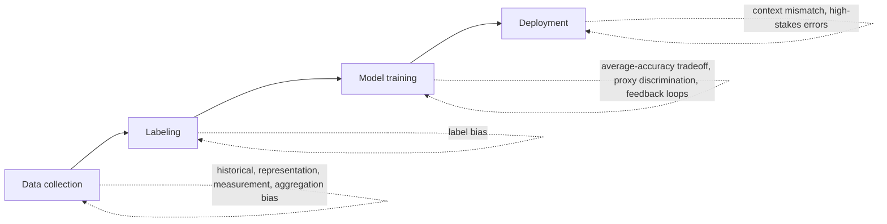
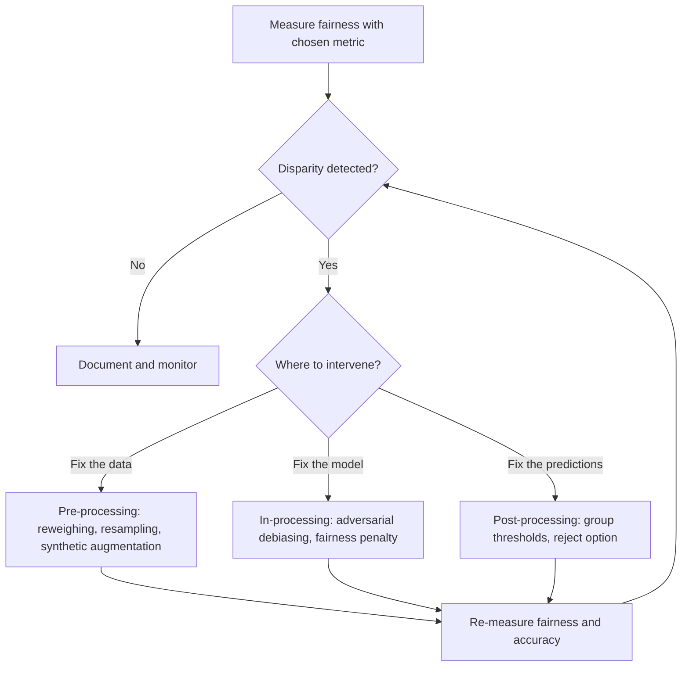
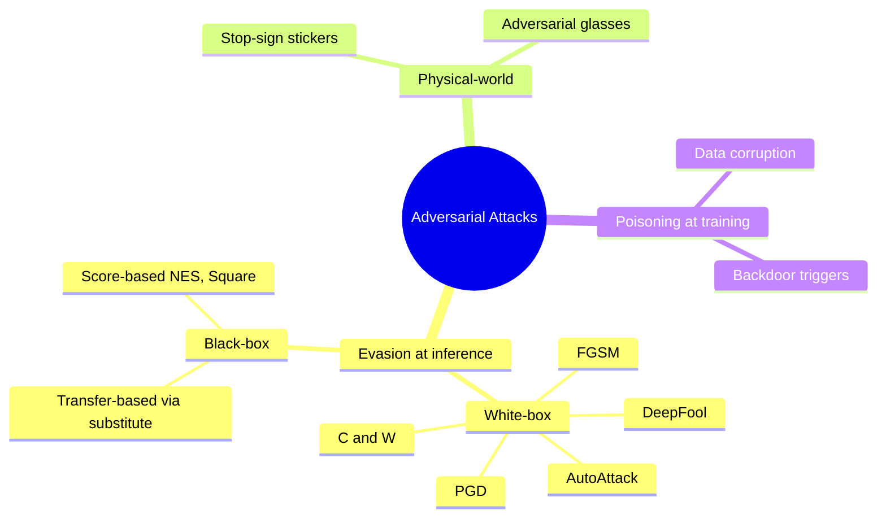
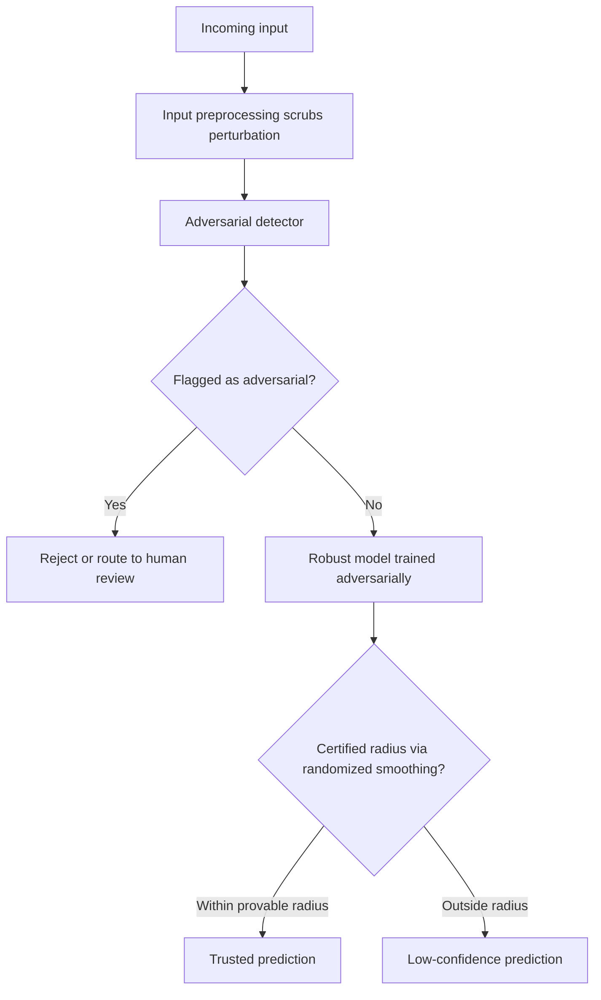
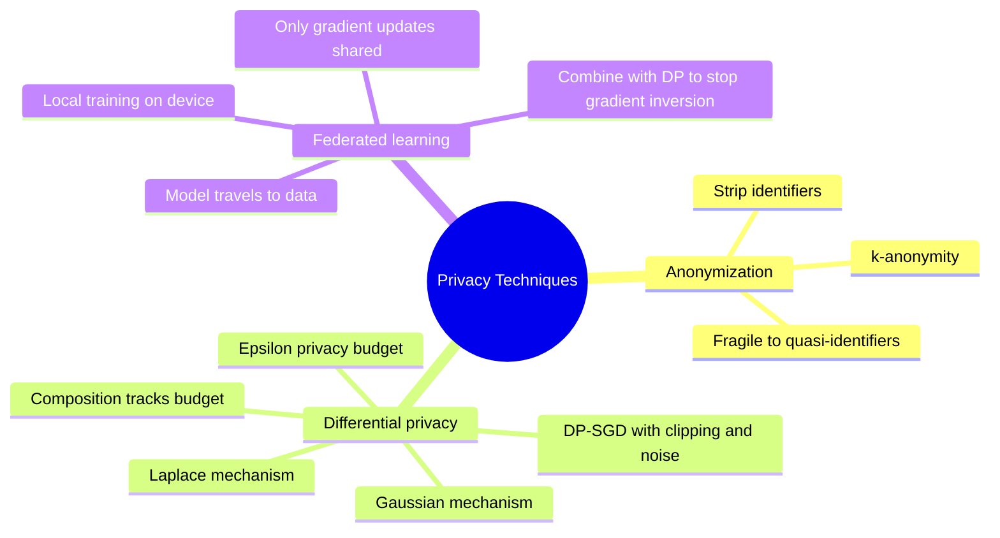
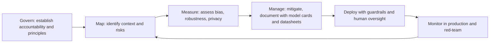

# AI Ethics and Safety

A machine learning model is a powerful pattern-finder, but it has no sense of right or wrong. Left unchecked, it can quietly discriminate against people, be tricked by a malicious input, leak the private data it was trained on, or make consequential decisions that no one can explain or appeal. **AI ethics and safety** is the discipline of anticipating these harms and engineering against them. This guide builds the field up from first principles across four areas bias and fairness, adversarial attacks, privacy, and responsible AI defining every term as it appears.

---

## 1. Bias and Fairness

A model is **biased** when it systematically produces worse or unfair outcomes for some group of people than others. Because models learn from data, and data reflects the world (including its history of discrimination), bias is the *default* outcome unless you actively measure and correct for it. The `01_bias_fairness.ipynb` notebook grounds this in concrete metrics and a worked hiring example.

### 1.1 Where bias comes from

Bias is not a single phenomenon; it enters at several stages.

**Data bias** problems baked into the training data:
- **Historical bias** the data faithfully records a discriminatory past (e.g., hiring records that favored men, so a model trained on them learns to favor men).
- **Representation bias** some groups are underrepresented, so the model sees too few examples to learn them well.
- **Measurement bias** the way a variable is measured differs in accuracy across groups.
- **Aggregation bias** forcing one model onto genuinely different subpopulations that would each need different handling.
- **Label bias** the human-assigned labels themselves reflect the annotators' subjective or cultural judgments.

**Algorithmic bias** problems introduced by the model and training process:
- Optimizing for *average* accuracy can quietly sacrifice accuracy on a minority subgroup.
- **Proxy discrimination** the model uses a seemingly neutral variable (like ZIP code) that correlates with a protected attribute (like race), achieving discrimination indirectly.
- **Feedback loops** a biased model's predictions shape future data, which trains an even more biased model.

**Deployment bias** the model is used in a context different from the one it was trained for, or its errors land harder in high-stakes settings.

Where bias enters across the ML pipeline:

### 1.2 Protected attributes and proxies

A **protected attribute** is a characteristic that law or ethics says must not drive decisions race, gender, age, disability, religion, sexual orientation, and so on (the exact list varies by jurisdiction). Crucially, *removing* the protected attribute from the data is not enough: **proxy variables** (ZIP code for race, first name for gender) can reconstruct it. Fairness must be measured, not assumed.

### 1.3 Fairness definitions

There is no single mathematical definition of "fair" there are several, and they capture different intuitions. Writing `Y` for the true outcome, `Ŷ` for the model's prediction, and `A` for a protected group, the notebook lays out the main ones:

- **Demographic (statistical) parity** each group receives positive predictions at the same rate. A common legal yardstick is the **disparate impact ratio**: the minority group's positive rate divided by the majority's should be at least 0.8 (the US "80% rule"). In the notebook's biased hiring data this ratio came out to 0.68 a clear failure.
- **Equal opportunity** among people who *truly* qualify, each group is correctly approved at the same rate (equal **true positive rates**, where a true positive is a correct "yes").
- **Equalized odds** a stricter version requiring both the true positive rate *and* the **false positive rate** (wrongly saying "yes") to match across groups.
- **Predictive parity (calibration)** a given predicted probability means the same thing for every group.
- **Individual fairness** similar individuals receive similar predictions.
- **Counterfactual fairness** the prediction would be unchanged if only the person's protected attribute were different.

### 1.4 The impossibility theorem

These definitions cannot all be satisfied at once. The **Chouldechova (2017) impossibility result** proves that when groups have different base rates (different underlying frequencies of the outcome), you *cannot* simultaneously achieve predictive parity, equal false positive rates, and equal false negative rates. The practical consequence is profound: **choosing a fairness criterion is a value judgment, not a technical optimization.** Engineers and stakeholders must decide which notion of fairness matters for their context.

### 1.5 Mitigation strategies

Interventions are grouped by *when* they act:

- **Pre-processing (fix the data)** **reweighing** (give underrepresented groups more weight), resampling, or synthetic data augmentation, applied before training.
- **In-processing (fix the model)** build fairness into training itself: **adversarial debiasing** (train so that a second model cannot guess the protected attribute from the output), or add a **fairness penalty** to the loss so the model is rewarded for being both accurate *and* fair.
- **Post-processing (fix the predictions)** adjust outputs after the fact: use group-specific decision **thresholds**, or apply a *reject option* that abstains on borderline cases.

A fairness mitigation flow, choosing an intervention by the stage it acts on:

The notebook demonstrates that mitigation is genuinely hard. Its threshold-optimization cell tried to equalize true positive rates between groups but the disparate-impact ratio barely moved, illustrating that gaps in *who gets approved* (selection rate) and gaps in *accuracy for those who qualify* (true positive rate) are distinct problems fixing one need not fix the other.

---

## 2. Adversarial Attacks and Robustness

A model can be highly accurate on ordinary data yet collapse on inputs crafted by an adversary. **Adversarial robustness** is the study of these attacks and the defenses against them. The `02_adversarial_attacks.ipynb` notebook implements the canonical attacks and a defense from scratch.

### 2.1 What an adversarial example is

An **adversarial example** is an input with a tiny, often imperceptible **perturbation** added so that the model misclassifies it usually with high confidence. The perturbation is kept small under some **norm**, a way of measuring its size:
- **L-infinity** bounds the largest change to any single pixel/feature.
- **L-2** bounds the total "energy" of the change.
- **L-0** bounds the *number* of features changed.

The unsettling lesson is that a model can be confidently, badly wrong on an input a human cannot distinguish from a correctly classified one.

### 2.2 White-box attacks

In a **white-box** setting the attacker has full access to the model, including its **gradients** (the directions in which changing the input most increases the model's error). This makes attacks efficient. The notebook implements the classics:

- **FGSM (Fast Gradient Sign Method)** a single step that nudges every input feature in the direction that increases the loss most. Fast and simple.
- **PGD (Projected Gradient Descent)** iterative FGSM: take many small steps, projecting back into the allowed perturbation region after each. PGD is regarded as the strongest *first-order* (gradient-based) attack robustness to PGD is a standard benchmark.
- **C&W (Carlini & Wagner)** an optimization-based attack that searches for the *smallest* perturbation causing misclassification; stronger but slower.
- **DeepFool** finds the minimal step needed to cross the decision boundary.
- **AutoAttack** an ensemble of parameter-free attacks, used as the de-facto standard for honestly reporting robustness.

The notebook's toy demo is striking: a classifier at 100% clean accuracy dropped to about 54% under both FGSM and PGD a coin-flip from imperceptible changes.

### 2.3 Black-box attacks

In a **black-box** setting the attacker can only *query* the model and observe outputs, with no access to gradients. Two routes still work:
- **Score-based** attacks estimate the gradient from observed output probabilities (e.g., NES) or use random search (Square Attack).
- **Transfer-based** attacks craft adversarial examples on a *substitute* model the attacker trains themselves; these examples often **transfer** and fool the real target, because different models share similar weaknesses.

### 2.4 Beyond evasion: physical-world and poisoning attacks

The attacks above are **evasion** attacks fooling a *trained* model at inference time. Two other categories matter:
- **Physical-world attacks** adversarial patterns that survive being printed and photographed: a sticker on a stop sign that fools a self-driving car, or glasses that defeat face recognition. These must be robust to real-world rotation, scale, and lighting.
- **Poisoning attacks** corrupting the *training* data so the model learns a flaw from the start (for example, a hidden "backdoor" that misbehaves only on a chosen trigger). Where evasion attacks the finished model, poisoning attacks the data it learns from.

A taxonomy of adversarial attack types:

### 2.5 Defenses

- **Adversarial training** the most effective defense: generate adversarial examples *during* training and train on them, so the model learns to resist them. It is formulated as a min-max problem (minimize loss against the worst-case perturbation) and is expensive. The notebook shows it works but at a cost: a model trained this way traded some clean accuracy (down to ~0.79) for meaningful robustness (~0.68 under attack, versus ~0.54 for the undefended model). This is the **robustness-accuracy tradeoff**.
- **Certified defenses (randomized smoothing)** instead of merely *hoping* a model is robust, provide a mathematical *guarantee*. By averaging predictions over many noisy copies of the input, you can certify that no perturbation below a provable radius can change the prediction.
- **Input preprocessing** transform inputs (compression, smoothing) to scrub perturbations. Weak on its own: *adaptive* attackers who know the defense can usually bypass it.
- **Adversarial detection** train a separate classifier just to flag inputs that look adversarial.

A layered defense flow against an incoming input:

---

## 3. Privacy in Machine Learning

Models trained on sensitive data medical records, financial histories, private messages can memorize and inadvertently leak it. **Privacy in ML** studies these leaks and the techniques that mathematically limit them. The `03_privacy.ipynb` notebook covers the attacks, differential privacy, and federated learning.

### 3.1 What we're protecting and how it leaks

**PII (Personally Identifiable Information)** is data that identifies a specific person name, social security number, medical condition. Leakage happens through several attacks:

- **Membership inference** determining whether a *specific record was in the training set*. Because models are often more confident on data they were trained on (an overfitting signal), an attacker can infer membership from confidence. This alone can be harmful: it can reveal that someone was in a medical trial. The notebook's demo trains a deliberately overfit model and shows higher average confidence on training data (0.88) than test data (0.81), giving an attack accuracy above the 0.5 random baseline.
- **Model inversion** *reconstructing* representative training inputs from a model's outputs; demonstrated by recovering recognizable faces from a face-recognition model.
- **Training-data extraction from LLMs** large language models memorize text they saw repeatedly, and a well-chosen prompt can make them regurgitate it verbatim, including PII and copyrighted material.

### 3.2 Anonymization and its limits

A first instinct is **anonymization**: stripping obvious identifiers. But removing a name is rarely enough combinations of *quasi-identifiers* (age, ZIP code, gender) can re-identify individuals by cross-referencing other datasets. Classical approaches like k-anonymity help but are fragile. This fragility is exactly why a stronger, mathematical guarantee was developed.

### 3.3 Differential privacy

**Differential privacy (DP)** provides a rigorous, mathematical promise: the output of an analysis is essentially the *same* whether or not any one individual's record is included. Formally, a mechanism is **(ε, δ)-differentially private** if, on any two datasets differing by a single record, the probabilities of any output differ by at most a factor of e^ε (plus a small slack δ). In plain terms:
- **ε (epsilon)** is the **privacy budget** *smaller means more private* (the presence of any one person matters less). Typical values run from about 0.1 to 10.
- **δ (delta)** is a tiny probability of failure, usually around 10⁻⁵ to 10⁻⁸.

DP is achieved by adding carefully calibrated **noise**. The amount needed depends on **sensitivity** how much one record can change the result. The notebook implements two core mechanisms:
- **Laplace mechanism** adds Laplace noise for a scalar query like a count; its demo on a count of 1,000 shows that a tighter budget (ε=0.1) injects more noise and larger error than a looser one.
- **Gaussian mechanism** adds Gaussian noise for vector queries, giving (ε, δ)-DP.

A key property is **composition**: privacy budget is *spent* with every query, and budgets accumulate. Run many analyses and total privacy erodes, so the budget must be tracked across an entire pipeline.

### 3.4 Private training with DP-SGD

To train a *whole model* privately, the standard algorithm is **DP-SGD (Differentially Private Stochastic Gradient Descent)**. It modifies ordinary training in two ways: each example's gradient is **clipped** to bound how much any single record can influence the update, and calibrated **noise** is added to the aggregated gradients. A **privacy accountant** tracks the cumulative ε across all training steps. The unavoidable catch is the **privacy-utility tradeoff**: more privacy means more noise, which means lower accuracy. The notebook shows that, in practice, libraries like Opacus let you keep your normal training loop and just attach a privacy engine targeting a chosen ε.

### 3.5 Federated learning

**Federated learning** is a complementary, architectural approach: instead of collecting everyone's data centrally, the model travels to the data. The server sends the model to each device, each device trains locally on its *private* data, and only the resulting **gradient updates** (not the raw data) are sent back and averaged. Raw data never leaves the device. The important caveat: gradients can *still* leak information (via **gradient inversion** attacks), so federated learning is often combined with differential privacy for a real guarantee.

The three families of privacy-protecting techniques and how they relate:

### 3.6 Privacy regulation

Laws like the EU's **GDPR (General Data Protection Regulation)** codify privacy principles: **data minimization** (collect only what you need), **purpose limitation** (use it only for the stated reason), and the **right to erasure** ("right to be forgotten"). Erasure is technically hard for ML removing a person's influence from an already-trained model leads to **machine unlearning** (Section 4.6).

---

## 4. Responsible AI

The first three sections address specific *technical* harms. **Responsible AI** is the surrounding layer of principles, documentation, governance, and regulation that turns those techniques into trustworthy deployed systems. The `04_responsible_ai.ipynb` notebook frames the principles, regulations, and safety tooling.

### 4.1 Core principles

Most responsible-AI frameworks converge on the same set of values:
- **Transparency** be open about how the system works and what data it uses.
- **Explainability** let people understand individual decisions.
- **Accountability** clear ownership, and a way for affected people to seek redress.
- **Fairness** no discriminatory outcomes (Section 1).
- **Privacy** data minimization and erasure (Section 3).
- **Safety** robust and reliable; does not cause harm.
- **Human oversight** humans can intervene and correct.

### 4.2 Regulation: the EU AI Act

The **EU AI Act (2024)** is the first comprehensive AI law and uses a **risk-based** approach, sorting systems into tiers:
- **Unacceptable risk (banned)** government social scoring, untargeted real-time biometric surveillance, subliminal manipulation.
- **High risk (heavily regulated)** AI in hiring, credit, medical devices, education, law enforcement; requires conformity assessment, human oversight, transparency, and data governance.
- **Limited risk (transparency obligations)** chatbots must disclose they are AI; deepfakes must be labeled.
- **Minimal risk (unregulated)** spam filters, game AI.

It also imposes extra rules on very large **GPAI (General-Purpose AI)** models. The notebook's risk-classification helper makes this concrete, sorting use cases like "CV screening" and "credit scoring" into *high risk* and "real-time biometric surveillance" into *prohibited*.

### 4.3 Regulation: GDPR Article 22 and NIST

- **GDPR Article 22** gives people the right *not* to be subject to solely automated decisions with legal or similarly significant effects entailing a right to meaningful information about the logic, a right to human review, and a right to contest.
- The **NIST AI Risk Management Framework** is a voluntary US framework organized around four functions: **Govern** (establish accountability), **Map** (identify context and risks), **Measure** (assess them), and **Manage** (prioritize and address them).

### 4.4 Documentation

You cannot govern what you do not document:
- **Model Cards** structured documentation for a model covering its intended use, the groups it was evaluated on, performance metrics *broken down by subgroup*, training and evaluation data, ethical considerations, and limitations. The notebook builds an example credit-risk model card whose per-group metrics and disparate-impact analysis make fairness auditable rather than assumed.
- **Datasheets for Datasets** the equivalent for data: its motivation, composition, collection process, and intended uses, so downstream users understand what they are building on.

### 4.5 LLM safety

Large language models bring their own safety challenges, addressed by a layered toolkit:
- **Constitutional AI** train the model to critique and revise its own responses against a written set of principles (a "constitution"), reducing reliance on human labeling of every harmful case.
- **RLHF (Reinforcement Learning from Human Feedback)** humans rate outputs for helpfulness, honesty, and harmlessness; a reward model learns those preferences; the LLM is fine-tuned to maximize the reward.
- **Guardrails** runtime filters around the model: **input guardrails** screen incoming requests, system-prompt instructions constrain behavior, and **output guardrails** check responses before they reach the user. The notebook's simple guardrail demo blocks disallowed requests while passing benign ones a minimal version of what production systems do at scale.
- **Red-teaming** deliberately attacking your own model to find failures (bias, misinformation, privacy leaks, **jailbreaks** prompts that bypass safety rules), either manually or with another LLM generating adversarial prompts.

### 4.6 Provenance and unlearning

- **Watermarking** embedding a detectable statistical signature in AI-generated text or images so it can later be identified as machine-made (e.g., biasing token choices toward a secret "green list"). Paired with **deepfake detection** (spotting generation artifacts) and provenance standards like **C2PA** (cryptographically signed content credentials), this addresses synthetic-media misuse.
- **Machine unlearning** removing a specific record's influence from a trained model, as required by the right to erasure. *Exact* unlearning means retraining from scratch without the data (costly); *approximate* unlearning uses cheaper techniques to undo a record's effect well enough.

---

## 5. Putting It Together

The responsible-AI governance loop, built on the NIST functions, runs continuously over a deployed system:

These four areas reinforce one another. **Fairness** ensures the model treats people equitably; **robustness** ensures an adversary cannot manipulate it; **privacy** ensures it does not betray the people in its training data; and **responsible AI** wraps all three in documentation, governance, and regulation so the system is transparent, accountable, and subject to human oversight. None is optional in a high-stakes deployment, and several involve genuine *tradeoffs* fairness criteria that conflict, robustness bought with accuracy, privacy bought with utility. The engineer's job is not to pretend these tradeoffs away but to make them deliberately, measure the result, and document the choice.

---

## 5. EU AI Act: Practical Compliance

The EU AI Act (in force August 2024, phased implementation through 2026-2027) is the world's first comprehensive AI regulation. It classifies AI systems by risk tier and imposes obligations proportional to risk.

Risk tiers: Unacceptable risk (banned outright: real-time biometric surveillance in public, social scoring by governments, subliminal manipulation). High risk (heavily regulated: hiring, credit scoring, medical devices, critical infrastructure, law enforcement, requires technical documentation, bias testing, logging, human oversight, explainability). Limited risk (transparency duties: chatbots must identify as AI). Minimal risk (no special rules: spam filters).

For engineers building high-risk systems: create a risk management system, document training data and quality measures, implement automatic logging of every AI decision (10-year retention), provide explainability for each decision, ensure human override capability, test for demographic bias before deployment.

---

## 6. Copyright and AI

AI-generated content raises three distinct legal questions: (1) Can you use copyrighted data to train an AI?, Ongoing litigation, fair use analysis varies by jurisdiction. (2) Can AI-generated output be copyrighted?, No, in the US and EU without substantial human creative contribution. (3) Who owns the model weights?, Governed by the license chosen by the creator.

Model licenses matter: LLaMA-family models prohibit certain commercial uses. Apache 2.0 is the most permissive. CC-BY requires attribution. Engineers must check the license of every model they deploy commercially.

Practical risk mitigation: document all training data sources, prefer permissively licensed data, use providers offering IP indemnification for production, never claim copyright over purely AI-generated content.

---

## 7. Deepfake Detection

Deepfakes are AI-generated or AI-manipulated media (images, video, audio) that appear authentic. Detection approaches: visual forensics (frequency domain artifacts, facial landmark consistency, EXIF metadata), ML classifiers (EfficientNet fine-tuned on FaceForensics++), audio analysis (MFCC features, spectral artifacts in cloned voices).

No detector is reliable against all deepfakes. Provenance-based approaches are more robust: C2PA (Coalition for Content Provenance and Authenticity) embeds cryptographic provenance metadata in files at creation time, making manipulation detectable by breaking the chain.
