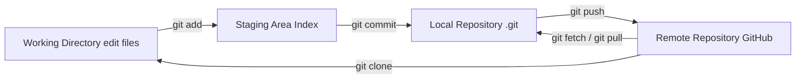
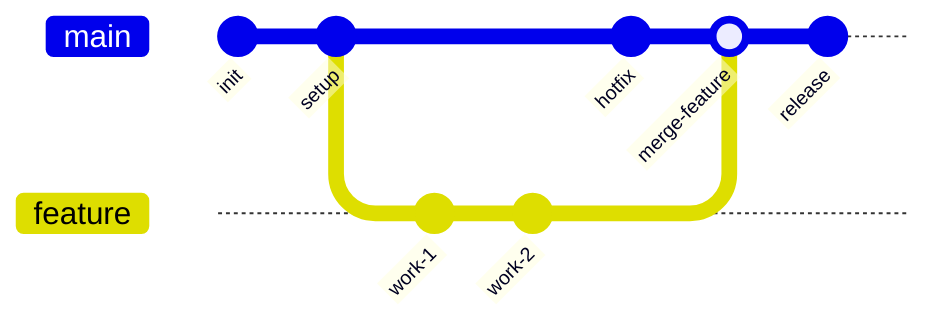
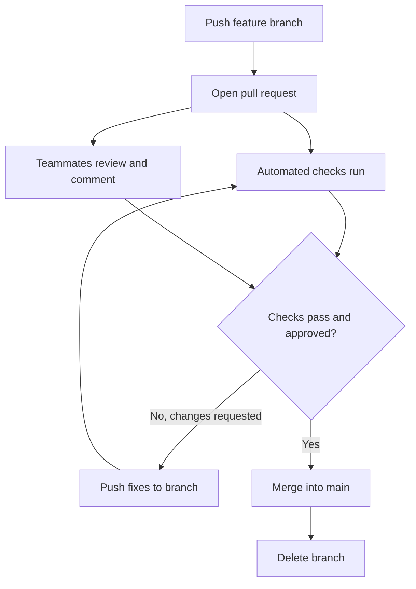
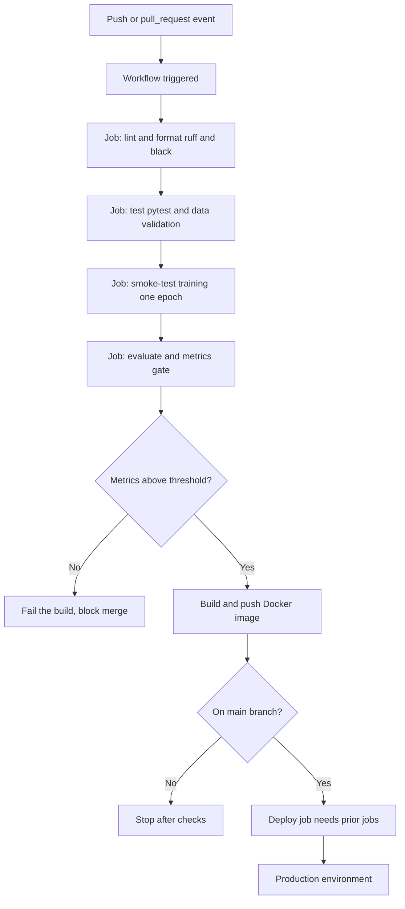

# Git and DevOps

Every serious software project and every serious machine learning project needs a way to track changes, collaborate without chaos, and automate the tedious work of testing and shipping. **Git** is the universal tool for tracking changes, and **DevOps** is the broader practice of automating the path from code to running software. This guide builds both from absolute scratch: first the fundamentals of version control, then the special difficulties ML projects bring, and finally the automation pipelines that tie it all together.

---

## 1. Version Control Fundamentals

### 1.1 What version control is and why it matters

**Version control** is a system that records every change to a set of files over time, so you can review history, recover old states, and collaborate safely. Without it, teams resort to emailing files named `final_v2_REALfinal.py` and overwriting each other's work. Version control solves four problems at once:
- It tracks **every change** over time.
- It lets multiple people work in parallel **without overwriting** each other.
- It lets you **roll back** to any previous state.
- It records **why** each change was made, through commit messages.

**Git** is the dominant version-control system. It is **distributed**, meaning every developer has a full copy of the entire history on their own machine, rather than depending on a central server for every operation.

### 1.2 The repository and Git's three trees

A **repository** (or **repo**) is a project folder that Git is tracking; the history lives in a hidden `.git/` directory inside it. The single most important mental model covered up front in `01_git_basics.ipynb` is Git's **three-tree architecture**, which describes the journey of a change:

```
Working Directory  →  Staging Area (Index)  →  Repository (.git/)
   (you edit files)     (git add)               (git commit)
```

The Git workflow as a flow from local edits all the way to the shared remote:



- The **working directory** is the files as they exist on disk, where you make edits.
- The **staging area** (or **index**) is a holding zone where you assemble exactly the changes you want to record next. Staging is what lets you commit *some* of your edits and leave others for later.
- The **repository** is the permanent history of committed snapshots.

### 1.3 Commits

A **commit** is a saved snapshot of your project at a moment in time, with an author, a timestamp, and a message describing the change. The two-step rhythm of daily Git work is **stage then commit**: `git add` moves chosen changes into the staging area, and `git commit` records them permanently. Each commit has a unique identifier (a hash like `abc1234`) and points back to its parent, so the full history forms a chain you can walk, inspect (`git log`, `git show`, `git blame`), and compare (`git diff`).

A good commit message matters because it is the *why* behind a change. The notebook recommends **Conventional Commits**, a structured format like `feat(rag): add hybrid search` or `fix(model): correct label encoder`, where a type prefix (`feat`, `fix`, `docs`, `test`, `refactor`, `chore`, etc.) makes history machine-readable and changelogs automatic.

### 1.4 Branches

A **branch** is an independent line of development a movable pointer to a commit that lets you work on something new without disturbing the main line. You create a branch for a feature, commit freely on it, and the stable `main` branch stays untouched until you are ready. In `01_git_basics.ipynb`, the branching section shows how parallel lines of work are kept separate and later recombined. Branches are cheap and fast in Git, which is why they are used liberally typically one per feature or experiment.

A feature branch diverging from and later merging back into main:



### 1.5 Merging and the merge/rebase distinction

Eventually a branch's work must rejoin the main line. There are two ways:

- **Merge** combine two branches, creating a **merge commit** that has two parents. This *preserves the full history*, including the fact that work happened in parallel.
- **Rebase** *replay* your branch's commits on top of another branch, producing a clean, linear history as if the work had happened sequentially. It rewrites commit identities in the process.

The crucial rule, stressed in the notebook: **never rebase a branch others are sharing**, because rewriting shared history breaks everyone else's copy.

When two branches change the *same lines*, Git cannot decide automatically and raises a **merge conflict**. Git marks the competing versions in the file with `<<<<<<<`, `=======`, and `>>>>>>>` markers; you choose what to keep, remove the markers, then `git add` and commit the resolution. The notebook walks through exactly this.

### 1.6 Remotes, pushing, pulling, and pull requests

A **remote** is a copy of the repository hosted elsewhere typically on a service like GitHub that the team shares. The key operations:
- **clone** copy a remote repo to your machine.
- **fetch** download new commits from the remote without changing your work.
- **pull** fetch *and* merge the remote's changes into your branch.
- **push** upload your commits to the remote.

A **pull request** (PR) is the standard collaboration ritual on hosted platforms: you push your branch, open a PR proposing to merge it into `main`, teammates review and comment, automated checks run, and once approved it is merged. The PR is where code review and automated testing meet the natural hook for the CI/CD discussed in Section 3.

The pull-request review flow from open to merge:



### 1.7 Branching strategies

Teams adopt conventions for how branches and merges are organized:
- **GitHub Flow** simple: branch off `main`, open a PR, merge back. Ideal for web apps and continuous deployment.
- **GitFlow** more elaborate, with long-lived `develop` and `release` branches; suited to versioned software with formal release cycles.
- **Trunk-based development** everyone commits to `main` frequently with very short-lived branches, using **feature flags** (switches that hide unfinished work) to keep `main` always releasable. Favored by high-velocity teams doing continuous delivery.

### 1.8 Safety nets and hygiene

Git is forgiving if you know its escape hatches: `git revert` safely undoes a commit by creating an inverse one, `git reset` moves the branch pointer back, `git stash` temporarily shelves work in progress, and `git reflog` records every move of `HEAD` so even "lost" commits can usually be recovered. A **`.gitignore`** file tells Git which files to never track for ML that means caches, virtual environments, secrets (`.env`, credentials), and large data/model files, which need special handling (Section 2). **Pre-commit hooks** automatically run checks (formatting, linting, blocking oversized files or leaked keys) before a commit is allowed, catching problems early.

---

## 2. Git for Machine Learning

Standard Git was built for source code: small text files that diff cleanly. ML projects break those assumptions models are large binary blobs, datasets run to gigabytes, notebooks store as unreadable JSON, and the *code* alone does not capture an experiment's hyperparameters. The `02_git_for_ml.ipynb` notebook addresses each mismatch.

### 2.1 The core challenges

| Challenge | Why plain Git struggles | The fix |
|-----------|------------------------|---------|
| Large model files | Repo balloons and slows | Git LFS, DVC |
| Large datasets | Too big to store in Git | DVC, cloud storage |
| Notebook diffs | JSON diffs are unreadable | nbstripout, nbdime, jupytext |
| Experiment tracking | Commits miss hyperparameters | MLflow, Weights & Biases |
| Reproducibility | A requirements file isn't enough | Docker, lock files |

### 2.2 Handling large files: Git LFS and DVC

Git stores a full copy of every version of every file, so committing a 2 GB model directly bloats the repo permanently. Two tools solve this by keeping a small **pointer** in Git and the heavy content elsewhere:

- **Git LFS (Large File Storage)** replaces large files with text pointers in Git, storing the real bytes on a separate LFS server. You tell it which file types to track (`*.pt`, `*.onnx`, `*.safetensors`, etc.), and from then on you add those files normally. Simple, but hosting free tiers are small (around 1 GB), so it suits moderately large artifacts.
- **DVC (Data Version Control)** layers data and model versioning on top of Git, using *any* storage backend (S3, GCS, Azure, SSH). When you `dvc add` a dataset, DVC stores a lightweight `.dvc` pointer file *in Git* and pushes the actual data to a configured **remote**. A teammate runs `git clone` then `dvc pull` to retrieve both code and the exact data. DVC also offers **pipelines** a `dvc.yaml` file declaring stages (preprocess → train → evaluate) with their inputs, outputs, parameters, and metrics so `dvc repro` re-runs only the stages whose inputs changed, much like a build system for ML.

### 2.3 Versioning models and experiments

Beyond the files, you need to track *which model is which*. Several lightweight conventions help:
- **Git tags** mark specific commits as named versions e.g., tagging a commit `model-v1.2.0` with a message recording its accuracy and F1 score, so you can later check out that exact model state.
- **Semantic Versioning (SemVer)** `MAJOR.MINOR.PATCH` applied to models: a **MAJOR** bump for an incompatible change (different input schema), **MINOR** for a backward-compatible new capability, **PATCH** for a bug fix or retrain.
- **Experiment tracking tools** **MLflow** and **Weights & Biases** record the hyperparameters, metrics, and artifacts of each run, which commits alone cannot capture. The notebook shows MLflow logging the **Git commit hash** with each run, so every experiment is tied back to the exact code that produced it closing the loop between code version and result.

### 2.4 Notebooks under version control

Jupyter notebooks (`.ipynb`) are stored as JSON containing code, outputs, and metadata, so a normal `git diff` is an unreadable wall of JSON. Three remedies:
- **nbstripout** strips outputs before committing, so only code changes appear in diffs.
- **jupytext** syncs a notebook with a plain `.py` script; you commit and review the readable script.
- **nbdime** a notebook-aware diff/merge tool that shows changes cell by cell.

### 2.5 Reproducibility

Reproducing a result requires pinning everything: exact dependency versions (lock files rather than loose ranges), often a **Docker** container capturing the entire environment, the data version (via DVC), and the code version (via Git). A thorough ML `.gitignore` which the notebook generates keeps caches, environments, raw data, model binaries, secrets, and MLOps tool directories (`mlruns/`, `wandb/`) out of the repo, leaving Git to track only what it handles well.

---

## 3. CI/CD with GitHub Actions

**DevOps** is the practice of automating and tightening the loop between writing code and running it in production. Its centerpiece is **CI/CD**:
- **CI (Continuous Integration)** automatically building and *testing* every change as it's pushed, so problems are caught immediately rather than at release time.
- **CD (Continuous Delivery/Deployment)** automatically *shipping* changes that pass the tests, all the way to production.

**GitHub Actions** is GitHub's built-in CI/CD platform, configured with YAML files. The `03_github_actions_cicd.ipynb` notebook builds up from its basics to full ML pipelines.

### 3.1 The building blocks

GitHub Actions has a strict hierarchy:

```
Workflow (a .yml file in .github/workflows/)
  └── Job (runs on one runner machine)
        └── Step (a single command or reusable action)
```

| Term | Meaning |
|------|---------|
| **Workflow** | A YAML file defining one automation |
| **Event / Trigger** | What starts the workflow |
| **Job** | A group of steps running together on one machine |
| **Step** | A single command or action |
| **Action** | A reusable, shareable step from the marketplace |
| **Runner** | The virtual machine that executes a job |
| **Artifact** | A file a workflow produces and saves |

### 3.2 Triggers, jobs, and steps

A workflow declares **triggers** under `on:` common ones are `push` and `pull_request` (run on every push or PR), `schedule` (run on a cron timetable, e.g., a weekly retraining), and `workflow_dispatch` (a manual button). Each **job** names a **runner** (usually GitHub-hosted `ubuntu-latest`) and lists **steps**. Steps either run a shell command or invoke a prebuilt **action** with `uses:` like `actions/checkout` to fetch the code or `actions/setup-python` to install a Python version. A **matrix** strategy runs the same job across several configurations at once (e.g., multiple Python versions), and **caching** (`actions/cache`) reuses downloaded dependencies between runs to save time.

### 3.3 Secrets

Pipelines often need credentials cloud keys, API tokens. These are stored as **secrets** in the repository settings and injected at runtime as `${{ secrets.NAME }}`, never hardcoded in the YAML or code. The notebook stresses the best practices: keep separate secrets per environment (dev/staging/prod) and rotate them regularly.

### 3.4 What an ML pipeline automates

Generic CI tests code; an *ML* pipeline tests code **and** the model. The notebook assembles these ML-specific stages:
- **Linting and formatting** tools like `ruff` and `black` enforce consistent, error-free code style.
- **Testing** `pytest` runs unit and integration tests, including data-validation tests.
- **Smoke-testing training** run the training script briefly (one epoch, a tiny sample) to confirm the pipeline executes end to end without errors.
- **A metrics gate** the distinctive ML check: after evaluation, a script asserts that key metrics (accuracy, F1) meet minimum thresholds and *fails the build* if the model regressed. The notebook's `check_metrics.py` does exactly this, exiting with an error when a metric falls below its floor, so a worse model cannot silently be merged.
- **Reporting on the PR** tools like **CML (Continuous Machine Learning)** post metrics and plots as a comment directly on the pull request, so reviewers see the model's performance alongside the code.
- **Building and pushing a container** package the model service as a Docker image and push it to a registry.
- **Deploying on merge** a deploy job that runs *only* after tests pass and *only* on the `main` branch, using `needs:` (to depend on the test job) and `if:` conditions to gate it.

### 3.5 Reusable workflows, environments, and GPU runners

Larger setups use a few more features:
- **Reusable workflows** factor common logic into a workflow other workflows call via `workflow_call`, avoiding duplication.
- **Environments** named deployment targets (like `production`) that can require manual approval before a deploy job runs.
- **Self-hosted runners** GitHub's default runners have no GPU, so GPU training requires registering your *own* GPU machine as a runner and targeting it with `runs-on: self-hosted`.

### 3.6 A complete pipeline

A full GitHub Actions ML CI/CD pipeline from a push event through chained jobs to deployment:



Tying it together, a full ML CI/CD pipeline chains dependent jobs: **lint → test → evaluate → deploy**, where each job declares `needs:` on the previous so they run in order, the evaluate job runs only on pull requests, and the deploy job runs only on `main` after everything passes. This is DevOps applied to ML every change automatically validated, every model checked against a quality bar, and only vetted changes reaching production.

---

## 4. Putting It Together

These three layers stack naturally. **Git fundamentals** give you a reliable history and safe parallel collaboration through branches, merges, and pull requests. **Git for ML** extends that discipline to the things plain Git handles poorly large data and models (Git LFS, DVC), unreadable notebooks (nbstripout, nbdime), and experiment metadata (MLflow tied to commit hashes) so an entire experiment is reproducible from a single commit. **CI/CD with GitHub Actions** then automates the work around every change: linting, testing, a model-metrics gate, and gated deployment. The result is an ML project that behaves like well-engineered software versioned, reproducible, tested, and shipped automatically which is precisely what the broader practice of MLOps aims for.

---

## 4. Semantic Versioning and Release Automation

Semantic versioning (SemVer) uses the format MAJOR.MINOR.PATCH. MAJOR increments on breaking changes (users must update code). MINOR increments on new backward-compatible features. PATCH increments on backward-compatible bug fixes.

Conventional Commits formalizes commit messages: feat: adds a MINOR version, fix: adds a PATCH version, BREAKING CHANGE: in the commit footer adds a MAJOR version. This convention enables fully automated versioning and changelog generation.

Tools: semantic-release (fully automated release pipeline), conventional-changelog, changesets. GitHub Actions can analyze commits since the last tag, determine the next version, generate a CHANGELOG.md, create a git tag, and publish a release automatically.

For ML systems, version models with code version + data version + training config together. Use MLflow model registry for model versioning and Docker image tags (include model version in the tag) for serving.
